# 2.X. Thiết kế biểu đồ hệ thống

## Sơ đồ usecase tổng quát

Dưới đây là sơ đồ usecase tổng quát mô tả toàn bộ các tác nhân chính trong hệ thống gồm Người dùng (Khách hàng) và Quản trị viên (Admin) cùng các chức năng mà mỗi tác nhân có thể thực hiện trong ứng dụng thương mại điện tử bán quần áo và phụ kiện.

```mermaid
graph TB
    subgraph HỆ THỐNG THƯƠNG MẠI ĐIỆN TỬ
        UC1["Đăng ký tài khoản"]
        UC2["Đăng nhập"]
        UC3["Đăng xuất"]
        UC4["Quên mật khẩu"]
        UC5["Xem danh sách sản phẩm"]
        UC6["Xem chi tiết sản phẩm"]
        UC7["Tìm kiếm & Lọc sản phẩm"]
        UC8["Đánh giá sản phẩm"]
        UC9["Quản lý giỏ hàng"]
        UC10["Đặt hàng"]
        UC11["Xem đơn hàng của tôi"]
        UC12["Cập nhật hồ sơ cá nhân"]
        UC13["Đổi mật khẩu"]
        UC14["Xem thông báo"]
        UC15["Xem voucher"]
        UC16["Quản lý sản phẩm"]
        UC17["Quản lý đơn hàng"]
        UC18["Quản lý người dùng"]
        UC19["Xem thống kê Dashboard"]
        UC20["Cài đặt hệ thống"]
    end

    User["👤 Người dùng"]
    Admin["🔧 Quản trị viên"]

    User --> UC1
    User --> UC2
    User --> UC3
    User --> UC4
    User --> UC5
    User --> UC6
    User --> UC7
    User --> UC8
    User --> UC9
    User --> UC10
    User --> UC11
    User --> UC12
    User --> UC13
    User --> UC14
    User --> UC15

    Admin --> UC2
    Admin --> UC16
    Admin --> UC17
    Admin --> UC18
    Admin --> UC19
    Admin --> UC20
```

*Hình 2.1: Sơ đồ usecase tổng quát*

Trong Hình 2.1 – Biểu đồ use case tổng quan của hệ thống, sự phân chia vai trò người dùng được thiết kế rõ ràng nhằm đảm bảo hiệu quả vận hành và tối ưu hóa trải nghiệm cho từng đối tượng. Hệ thống phục vụ hai nhóm vai trò chính, mỗi vai trò được gán nhiệm vụ và quyền hạn cụ thể để đáp ứng yêu cầu nghiệp vụ của hệ thống.

**Người dùng (Khách hàng):** Là nhóm đối tượng trung tâm, trực tiếp sử dụng hệ thống để phục vụ nhu cầu mua sắm quần áo và phụ kiện trực tuyến. Người dùng có thể đăng ký và đăng nhập vào ứng dụng, duyệt và tìm kiếm sản phẩm theo danh mục, giá cả hoặc đánh giá, xem chi tiết sản phẩm, thêm sản phẩm vào giỏ hàng, thực hiện đặt hàng và thanh toán, theo dõi đơn hàng đã đặt, đánh giá sản phẩm sau khi mua, cập nhật hồ sơ cá nhân, đổi mật khẩu, xem thông báo và voucher khuyến mãi.

**Quản trị viên (Admin):** Là người giữ quyền hạn cao nhất, chịu trách nhiệm vận hành và duy trì hệ thống. Admin có thể quản lý toàn bộ danh mục sản phẩm (thêm, sửa, xóa), quản lý đơn hàng và cập nhật trạng thái giao hàng, quản lý tài khoản người dùng (xem thông tin, phân quyền, xóa tài khoản), theo dõi thống kê doanh thu và hoạt động hệ thống thông qua Dashboard, và cấu hình cài đặt hệ thống để đảm bảo hệ thống hoạt động an toàn, ổn định.

### Mô tả các Use Case chính

Hình 2.1 – Biểu đồ use case tổng quan hệ thống thương mại điện tử bán quần áo và phụ kiện thể hiện rõ các chức năng cốt lõi và nhu cầu của từng đối tượng người dùng, làm nền tảng cho việc triển khai chi tiết.

**Đăng nhập / Phân quyền:** Là bước khởi đầu cho tất cả các tác nhân. Người dùng (khách hàng, quản trị viên) phải xác thực danh tính thông qua email và mật khẩu, sau đó hệ thống sẽ tạo JWT Token và cấp quyền truy cập tương ứng với vai trò (user hoặc admin).

**Quản lý tài khoản người dùng:** Cho phép người dùng cập nhật thông tin cá nhân (tên, email, ảnh đại diện), đổi mật khẩu, khôi phục mật khẩu khi quên, duy trì tính chính xác và riêng tư dữ liệu.

**Tìm kiếm và duyệt sản phẩm:** Người dùng có thể tra cứu sản phẩm theo từ khóa, lọc theo danh mục (quần áo, phụ kiện), khoảng giá, số sao đánh giá; xem danh sách sản phẩm với phân trang và xem chi tiết từng sản phẩm.

**Quản lý giỏ hàng và đặt hàng:** Người dùng thêm sản phẩm vào giỏ hàng với các tùy chọn kích thước và màu sắc, điều chỉnh số lượng, sau đó thực hiện quy trình đặt hàng bao gồm nhập địa chỉ giao hàng, xác nhận đơn hàng và chọn phương thức thanh toán.

**Đánh giá sản phẩm:** Người dùng đánh giá sản phẩm bằng cách chấm điểm sao (1–5) và viết bình luận, giúp cộng đồng người mua tham khảo trước khi quyết định mua hàng.

**Theo dõi đơn hàng:** Người dùng được xem lại lịch sử đơn hàng, trạng thái giao hàng (Đang xử lý, Đang giao, Đã giao) và chi tiết từng đơn hàng.

**Quản lý hệ thống (Admin):** Quản trị viên chịu trách nhiệm quản lý danh mục sản phẩm, xử lý đơn hàng, quản lý tài khoản người dùng, giám sát doanh thu qua Dashboard và cấu hình cài đặt hệ thống.

## Sơ đồ usecase phân rã

### Sơ đồ usecase đăng nhập

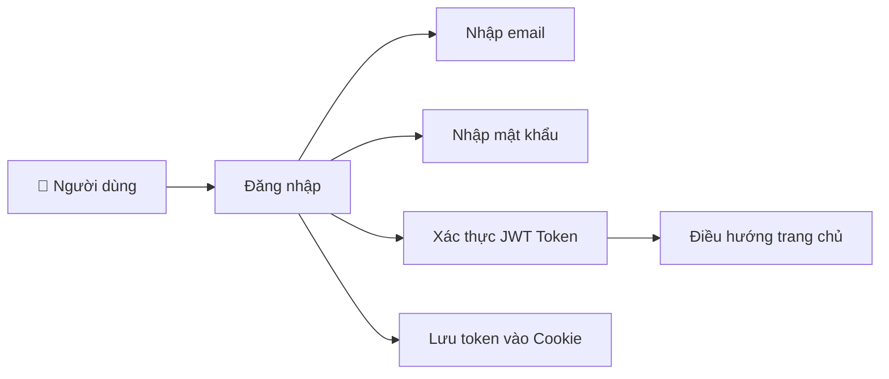

*Hình 2.2: Sơ đồ usecase đăng nhập*

Hình 2.2 mô tả luồng xử lý chức năng đăng nhập. Người dùng nhập email và mật khẩu vào form đăng nhập, hệ thống Backend sử dụng bcryptjs để so sánh mật khẩu với bản băm (hash) trong MongoDB. Nếu hợp lệ, hệ thống tạo JWT Token chứa thông tin định danh (userId, role) và lưu vào HTTP-only Cookie nhằm chống tấn công XSS. Sau đó, hệ thống điều hướng người dùng về trang chủ tương ứng với vai trò. Trường hợp sai thông tin, hệ thống phản hồi thông báo lỗi ngay trên giao diện để người dùng nhập lại.

### Sơ đồ usecase đăng ký

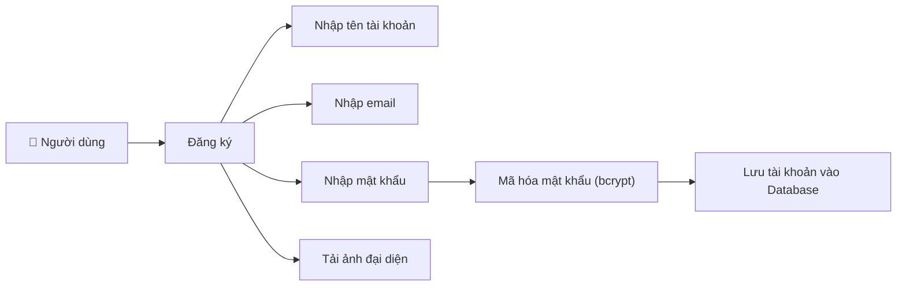

*Hình 2.3: Sơ đồ usecase đăng ký*

Hình 2.3 thể hiện luồng xử lý chức năng đăng ký tài khoản mới. Người dùng điền tuần tự các trường bắt buộc: tên tài khoản (5–30 ký tự), email hợp lệ, mật khẩu (tối thiểu 8 ký tự) và ảnh đại diện. Hệ thống kiểm tra tính hợp lệ từng trường trước khi cho phép gửi form. Mật khẩu được băm bằng bcryptjs, đảm bảo không lưu dạng plaintext. Ảnh đại diện được tải lên Cloudinary và trả về URL lưu vào hồ sơ. Sau khi xử lý xong, hệ thống tạo bản ghi người dùng trong MongoDB, đồng thời tự động tạo JWT Token và đăng nhập ngay.

### Sơ đồ usecase xem sản phẩm

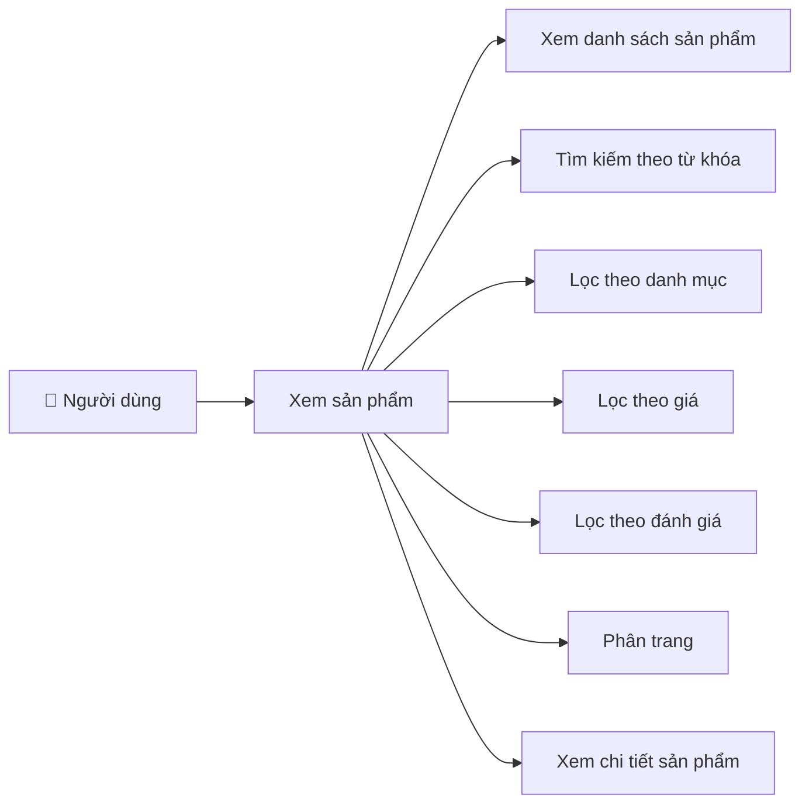

*Hình 2.4: Sơ đồ usecase xem sản phẩm*

Hình 2.4 mô tả luồng xử lý khi người dùng duyệt và tìm kiếm sản phẩm. Các bước con có mối quan hệ song song và bổ trợ lẫn nhau. Hệ thống trả về danh sách sản phẩm kèm cơ chế phân trang để tối ưu hiệu suất. Người dùng thu hẹp kết quả qua các bộ lọc hoạt động kết hợp: tìm kiếm theo từ khóa, lọc theo danh mục (quần áo, phụ kiện), khoảng giá và số sao đánh giá. Bước "Xem chi tiết sản phẩm" cho phép xem đầy đủ thông tin bao gồm hình ảnh, giá, mô tả, đánh giá và các tùy chọn kích thước, màu sắc.

### Sơ đồ usecase quản lý giỏ hàng

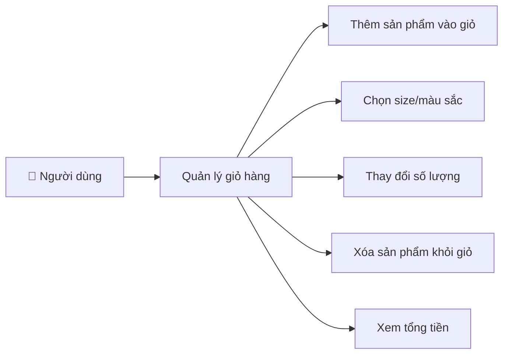

*Hình 2.5: Sơ đồ usecase quản lý giỏ hàng*

Hình 2.5 trình bày luồng xử lý quản lý giỏ hàng. Người dùng thêm sản phẩm vào giỏ kèm lựa chọn size/màu sắc từ trang chi tiết. Dữ liệu giỏ hàng được quản lý bằng Redux Store, cho phép cập nhật theo thời gian thực mà không cần tải lại trang. Các thao tác thay đổi số lượng và xóa sản phẩm có quan hệ nhân – quả trực tiếp với bước xem tổng tiền: mỗi khi thay đổi, hệ thống tự động tính lại tổng giá trị bao gồm giá sản phẩm, thuế và phí vận chuyển. Giỏ hàng được đồng bộ với localStorage để duy trì dữ liệu khi đóng trình duyệt.

### Sơ đồ usecase đặt hàng

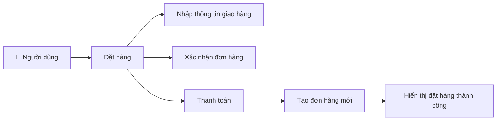

*Hình 2.6: Sơ đồ usecase đặt hàng*

Hình 2.6 mô tả quy trình đặt hàng mang tính tuần tự chặt chẽ. Người dùng nhập thông tin giao hàng (họ tên, địa chỉ, số điện thoại), hệ thống kiểm tra tính hợp lệ trước khi tiếp tục. Bước xác nhận đơn hàng hiển thị tổng quan gồm danh sách sản phẩm, phí vận chuyển và tổng tiền. Sau khi thanh toán thành công, hệ thống tạo đơn hàng mới trong MongoDB với trạng thái "Đang xử lý" và xóa giỏ hàng. Cuối cùng, hệ thống phản hồi thông báo đặt hàng thành công kèm mã đơn hàng để theo dõi.

### Sơ đồ usecase đánh giá sản phẩm

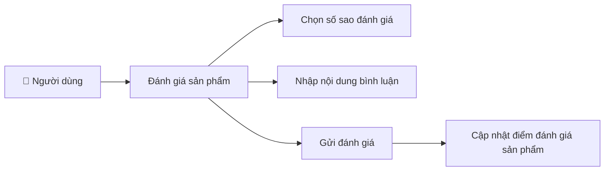

*Hình 2.7: Sơ đồ usecase đánh giá sản phẩm*

Hình 2.7 thể hiện quy trình đánh giá sản phẩm, giúp xây dựng cộng đồng phản hồi và hỗ trợ quyết định mua hàng. Người dùng đã đăng nhập chọn số sao (1–5) và nhập bình luận mô tả trải nghiệm. Khi gửi đánh giá, Backend kiểm tra nếu đã đánh giá trước đó thì cập nhật, nếu chưa thì tạo mới. Bước "Cập nhật điểm đánh giá" là hệ quả tự động: hệ thống tính lại điểm trung bình (average rating) và số lượng đánh giá (numOfReviews), hiển thị trên trang sản phẩm và ảnh hưởng trực tiếp đến bộ lọc theo đánh giá.

### Sơ đồ usecase cập nhật hồ sơ cá nhân

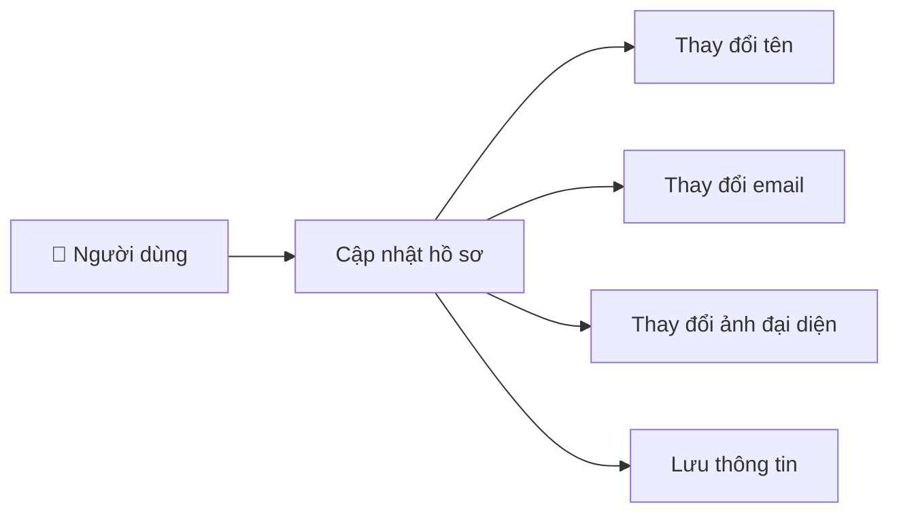

*Hình 2.8: Sơ đồ usecase cập nhật hồ sơ cá nhân*

Hình 2.8 trình bày luồng xử lý cập nhật hồ sơ cá nhân. Người dùng đã đăng nhập có thể chỉnh sửa ba trường thông tin hoạt động độc lập: tên hiển thị, email liên kết tài khoản và ảnh đại diện — không bắt buộc phải thay đổi tất cả cùng lúc. Khi tải ảnh mới, hệ thống xóa ảnh cũ trên Cloudinary, tải ảnh mới lên và nhận về URL mới. Bước "Lưu thông tin" gửi dữ liệu đã chỉnh sửa lên Backend qua API, cập nhật bản ghi trong MongoDB và phản hồi thông báo thành công cho giao diện.

### Sơ đồ usecase quản lý sản phẩm (Admin)

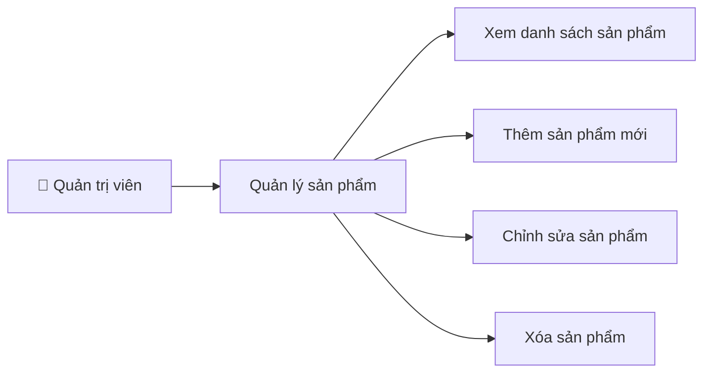

*Hình 2.9: Sơ đồ usecase quản lý sản phẩm*

Hình 2.9 mô tả chức năng quản lý sản phẩm dành cho quản trị viên, bao gồm nhóm thao tác CRUD cốt lõi. Quản trị viên xem danh sách sản phẩm dưới dạng bảng (mã, tên, giá, tồn kho), thêm sản phẩm mới với form nhập liệu (tên, mô tả, giá, danh mục, hình ảnh tải lên Cloudinary), chỉnh sửa sản phẩm với dữ liệu được điền sẵn vào form, và xóa sản phẩm khỏi MongoDB kèm xóa hình ảnh trên Cloudinary. Toàn bộ thao tác được bảo vệ bởi middleware xác thực quyền admin.

### Sơ đồ usecase quản lý đơn hàng (Admin)

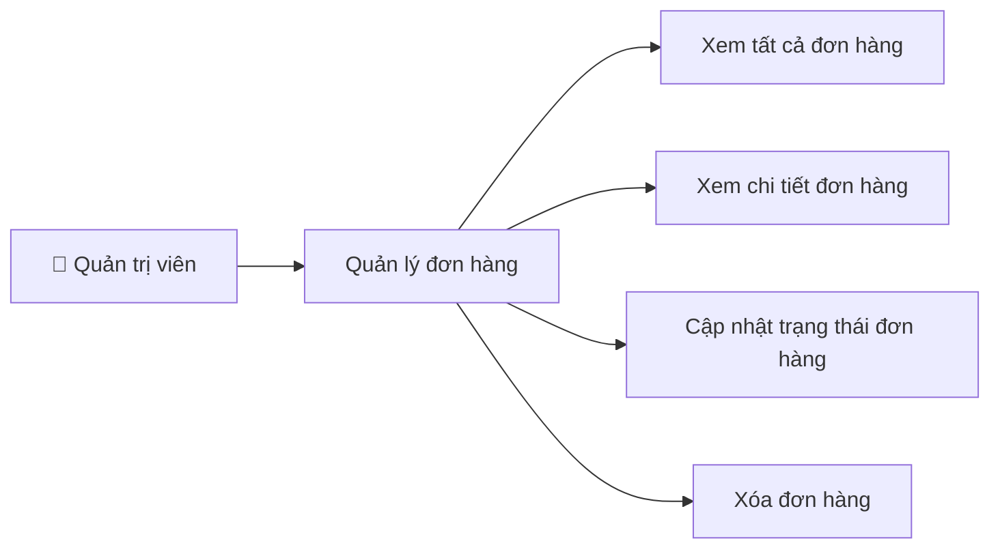

*Hình 2.10: Sơ đồ usecase quản lý đơn hàng*

Hình 2.10 mô tả chức năng quản lý đơn hàng dành cho quản trị viên. Bảng danh sách hiển thị toàn bộ đơn hàng gồm mã đơn, khách hàng, tổng tiền và trạng thái. Quản trị viên xem chi tiết từng đơn hàng (sản phẩm, thông tin giao hàng, thanh toán) và cập nhật trạng thái theo quy trình tuần tự "Đang xử lý → Đang giao → Đã giao". Đặc biệt, khi chuyển sang "Đã giao", hệ thống tự động trừ số lượng tồn kho của từng sản phẩm — đảm bảo tính chính xác dữ liệu kho. Quản trị viên cũng có thể xóa đơn hàng với xác nhận trước khi thực hiện.

### Sơ đồ usecase quản lý người dùng (Admin)

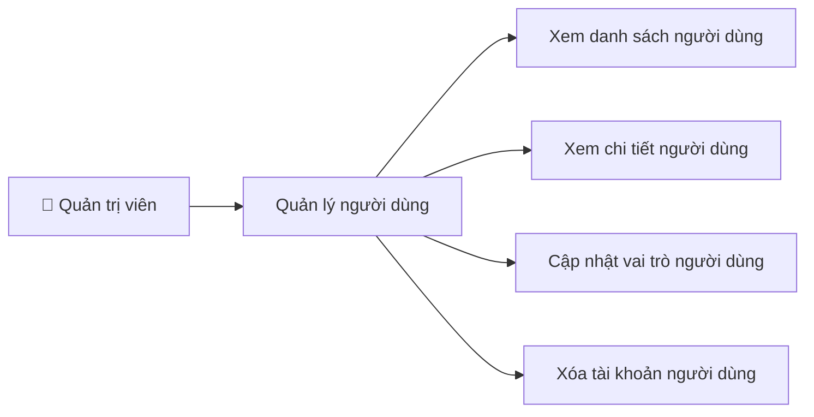

*Hình 2.11: Sơ đồ usecase quản lý người dùng*

Hình 2.11 trình bày chức năng quản lý người dùng giúp quản trị viên kiểm soát toàn bộ tài khoản. Bảng danh sách hiển thị thông tin tất cả tài khoản gồm tên, email, vai trò (user/admin) và hành động quản trị. Quản trị viên xem chi tiết từng tài khoản, cập nhật vai trò giữa "user" và "admin" — cơ chế phân quyền linh hoạt giúp mở rộng đội ngũ quản trị khi cần. Xóa tài khoản sẽ đồng thời xóa ảnh đại diện trên Cloudinary. Toàn bộ thao tác đều yêu cầu xác thực quyền admin thông qua middleware bảo mật.

---

## Đặc tả usecase

### Mô tả usecase đăng nhập

*Bảng 2.1: Mô tả usecase đăng nhập*

| Thuộc tính | Mô tả |
|---|---|
| **Tác nhân** | Người dùng, Quản trị viên |
| **Mô tả** | Người dùng đăng nhập vào hệ thống bằng cách nhập thông tin tài khoản (email và mật khẩu). |
| **Tiền điều kiện** | Hệ thống hoạt động bình thường. Người dùng đã có tài khoản hợp lệ trong hệ thống. |
| **Hậu điều kiện** | Tạo phiên đăng nhập hợp lệ thông qua JWT Token được lưu trong HTTP-only Cookie. Điều hướng tới trang chủ. |
| **Kịch bản** | 1. Người dùng mở màn hình Đăng nhập. 2. Hệ thống hiển thị form đăng nhập (email, mật khẩu). 3. Người dùng nhập thông tin, sau đó bấm nút "Đăng nhập". 4. Hệ thống xác thực thông tin: so sánh mật khẩu nhập vào với mật khẩu đã băm trong cơ sở dữ liệu bằng bcryptjs. 5. Xác thực thành công, hệ thống tạo JWT Token và lưu vào Cookie. 6. Đăng nhập thành công và chuyển hướng đến trang chủ. Kết thúc usecase. |
| **Kịch bản thay thế và ngoại lệ** | - Nếu nhập sai email hoặc mật khẩu: Hệ thống hiển thị thông báo "Đăng nhập thất bại, vui lòng kiểm tra tài khoản và mật khẩu". Người dùng quay lại bước nhập thông tin. - Nếu thiếu trường thông tin: Hệ thống hiển thị thông báo lỗi "Email hoặc mật khẩu không hợp lệ". Người dùng quay lại bước nhập thông tin. |

### Mô tả usecase đăng ký

*Bảng 2.2: Mô tả usecase đăng ký*

| Thuộc tính | Mô tả |
|---|---|
| **Tác nhân** | Người dùng |
| **Mô tả** | Người dùng tạo tài khoản mới trong hệ thống. |
| **Tiền điều kiện** | Hệ thống hoạt động bình thường. Email đăng ký chưa tồn tại trong hệ thống. |
| **Hậu điều kiện** | Tài khoản được tạo mới thành công. Mật khẩu được mã hóa bằng bcryptjs trước khi lưu vào cơ sở dữ liệu. |
| **Kịch bản** | 1. Người dùng lựa chọn mục Đăng ký để điều hướng sang màn Đăng ký. 2. Hệ thống hiển thị form đăng ký tài khoản. 3. Người dùng nhập Tên (5–30 ký tự), Email hợp lệ, Mật khẩu (tối thiểu 8 ký tự) và tải ảnh đại diện. 4. Người dùng bấm nút "Đăng ký". 5. Hệ thống kiểm tra thông tin, băm mật khẩu, tải ảnh lên Cloudinary và tạo tài khoản. 6. Đăng ký tài khoản thành công, tạo JWT Token và chuyển tới trang chủ. Kết thúc usecase. |
| **Kịch bản thay thế và ngoại lệ** | - Nếu email đã tồn tại: Hệ thống hiển thị thông báo "Email đã tồn tại". Quay lại bước nhập thông tin. - Nếu mật khẩu không đạt chuẩn (dưới 8 ký tự): Hệ thống hiển thị thông báo lỗi mật khẩu. Quay lại bước nhập thông tin. - Nếu tên không hợp lệ (dưới 5 hoặc trên 30 ký tự): Hệ thống hiển thị thông báo lỗi. Quay lại bước nhập thông tin. |

### Mô tả usecase xem sản phẩm

*Bảng 2.3: Mô tả usecase xem sản phẩm*

| Thuộc tính | Mô tả |
|---|---|
| **Tác nhân** | Người dùng |
| **Mô tả** | Người dùng duyệt, tìm kiếm và xem chi tiết sản phẩm trong hệ thống. |
| **Tiền điều kiện** | Hệ thống hoạt động bình thường. |
| **Hậu điều kiện** | Hiển thị danh sách sản phẩm hoặc thông tin chi tiết sản phẩm. |
| **Kịch bản** | 1. Người dùng vào trang Sản phẩm. 2. Hệ thống hiển thị danh sách sản phẩm với phân trang. 3. Người dùng có thể tìm kiếm theo từ khóa, lọc theo danh mục, khoảng giá hoặc số sao đánh giá. 4. Người dùng bấm vào một sản phẩm. 5. Hệ thống hiển thị trang chi tiết sản phẩm bao gồm: hình ảnh, tên, giá, mô tả, đánh giá và các tùy chọn (kích thước, màu sắc). Kết thúc usecase. |
| **Kịch bản thay thế và ngoại lệ** | - Nếu không tìm thấy sản phẩm phù hợp: Hệ thống hiển thị thông báo "Không tìm thấy sản phẩm". |

### Mô tả usecase quản lý giỏ hàng

*Bảng 2.4: Mô tả usecase quản lý giỏ hàng*

| Thuộc tính | Mô tả |
|---|---|
| **Tác nhân** | Người dùng |
| **Mô tả** | Người dùng thêm, sửa, xóa sản phẩm trong giỏ hàng. |
| **Tiền điều kiện** | Hệ thống hoạt động bình thường. Người dùng đã đăng nhập tài khoản vào hệ thống. |
| **Hậu điều kiện** | Giỏ hàng được cập nhật thành công. |
| **Kịch bản** | 1. Người dùng xem chi tiết sản phẩm, chọn kích thước và màu sắc. 2. Bấm nút "Thêm vào giỏ hàng". 3. Hệ thống lưu sản phẩm vào giỏ hàng (Redux Store). 4. Người dùng vào trang Giỏ hàng để xem danh sách sản phẩm đã thêm. 5. Người dùng có thể thay đổi số lượng hoặc xóa sản phẩm. 6. Hệ thống tự động cập nhật tổng tiền. Kết thúc usecase. |
| **Kịch bản thay thế và ngoại lệ** | - Nếu số lượng sản phẩm trong kho không đủ: Hệ thống hiển thị thông báo "Sản phẩm đã hết hàng". - Nếu giỏ hàng trống: Hệ thống hiển thị thông báo giỏ hàng trống. |

### Mô tả usecase đặt hàng

*Bảng 2.5: Mô tả usecase đặt hàng*

| Thuộc tính | Mô tả |
|---|---|
| **Tác nhân** | Người dùng |
| **Mô tả** | Người dùng thực hiện đặt mua sản phẩm từ giỏ hàng. |
| **Tiền điều kiện** | Hệ thống hoạt động bình thường. Người dùng đã đăng nhập. Giỏ hàng có ít nhất một sản phẩm. |
| **Hậu điều kiện** | Đơn hàng được tạo thành công và lưu vào cơ sở dữ liệu. |
| **Kịch bản** | 1. Người dùng bấm "Thanh toán" từ trang Giỏ hàng. 2. Hệ thống hiển thị form nhập thông tin giao hàng (họ tên, địa chỉ, số điện thoại, thành phố, quốc gia). 3. Người dùng nhập thông tin và bấm "Tiếp tục". 4. Hệ thống hiển thị trang xác nhận đơn hàng (danh sách sản phẩm, phí vận chuyển, tổng tiền). 5. Người dùng bấm "Tiến hành thanh toán". 6. Hệ thống hiển thị trang thanh toán. 7. Người dùng hoàn tất thanh toán. 8. Hệ thống tạo đơn hàng, hiển thị thông báo "Đặt hàng thành công". Kết thúc usecase. |
| **Kịch bản thay thế và ngoại lệ** | - Nếu thiếu thông tin giao hàng: Hệ thống hiển thị thông báo yêu cầu điền đầy đủ thông tin. Quay lại bước nhập thông tin. - Nếu thanh toán thất bại: Hệ thống thông báo lỗi thanh toán. Người dùng quay lại bước thanh toán. |

### Mô tả usecase đánh giá sản phẩm

*Bảng 2.6: Mô tả usecase đánh giá sản phẩm*

| Thuộc tính | Mô tả |
|---|---|
| **Tác nhân** | Người dùng |
| **Mô tả** | Người dùng đánh giá và bình luận sản phẩm đã mua. |
| **Tiền điều kiện** | Hệ thống hoạt động bình thường. Người dùng đã đăng nhập tài khoản vào hệ thống. |
| **Hậu điều kiện** | Đánh giá được lưu thành công. Điểm đánh giá trung bình của sản phẩm được cập nhật. |
| **Kịch bản** | 1. Người dùng vào trang Chi tiết sản phẩm. 2. Cuộn đến phần đánh giá, chọn số sao (1–5). 3. Nhập nội dung bình luận. 4. Bấm nút "Gửi đánh giá". 5. Hệ thống lưu đánh giá và tính lại điểm trung bình của sản phẩm. 6. Đánh giá được hiển thị trong danh sách bình luận. Kết thúc usecase. |
| **Kịch bản thay thế và ngoại lệ** | - Nếu người dùng đã đánh giá sản phẩm này: Hệ thống cập nhật đánh giá cũ thay vì tạo mới. |

### Mô tả usecase quản lý sản phẩm (Admin)

*Bảng 2.7: Mô tả usecase quản lý sản phẩm*

| Thuộc tính | Mô tả |
|---|---|
| **Tác nhân** | Quản trị viên (Admin) |
| **Mô tả** | Quản trị viên thêm, sửa, xóa sản phẩm trong hệ thống. |
| **Tiền điều kiện** | Hệ thống hoạt động bình thường. Quản trị viên đã đăng nhập với vai trò admin. |
| **Hậu điều kiện** | Thêm sản phẩm thành công. Sửa sản phẩm thành công. Xóa sản phẩm thành công. |
| **Kịch bản** | - **Trường hợp thêm sản phẩm:** 1. Quản trị viên vào trang Quản lý sản phẩm. 2. Bấm nút "Thêm sản phẩm mới". 3. Hệ thống hiển thị form thêm sản phẩm. 4. Quản trị viên nhập thông tin (tên, mô tả, giá, danh mục, kho, hình ảnh). 5. Bấm "Tạo sản phẩm". 6. Hệ thống tải ảnh lên Cloudinary, lưu sản phẩm vào cơ sở dữ liệu. Kết thúc usecase. - **Trường hợp sửa sản phẩm:** 1. Quản trị viên chọn sản phẩm cần sửa. 2. Hệ thống hiển thị form chỉnh sửa với thông tin hiện tại. 3. Cập nhật các trường thông tin cần thay đổi. 4. Bấm "Cập nhật". 5. Hệ thống lưu thông tin mới. Kết thúc usecase. - **Trường hợp xóa sản phẩm:** 1. Quản trị viên chọn sản phẩm cần xóa. 2. Hệ thống hiển thị xác nhận xóa. 3. Quản trị viên xác nhận. 4. Hệ thống xóa sản phẩm và ảnh trên Cloudinary. Kết thúc usecase. |
| **Kịch bản thay thế và ngoại lệ** | - Nếu nhập thiếu các trường bắt buộc: Hệ thống hiển thị thông báo yêu cầu nhập đủ thông tin. Quay lại bước nhập thông tin. - Nếu người dùng không có quyền admin: Hệ thống trả về lỗi 403 "Bạn không có quyền truy cập trang này". |

### Mô tả usecase quản lý đơn hàng (Admin)

*Bảng 2.8: Mô tả usecase quản lý đơn hàng*

| Thuộc tính | Mô tả |
|---|---|
| **Tác nhân** | Quản trị viên (Admin) |
| **Mô tả** | Quản trị viên xem, cập nhật trạng thái và xóa đơn hàng. |
| **Tiền điều kiện** | Hệ thống hoạt động bình thường. Quản trị viên đã đăng nhập với vai trò admin. |
| **Hậu điều kiện** | Cập nhật trạng thái đơn hàng thành công. Xóa đơn hàng thành công. |
| **Kịch bản** | 1. Quản trị viên vào trang Quản lý đơn hàng. 2. Hệ thống hiển thị toàn bộ danh sách đơn hàng. 3. Quản trị viên chọn một đơn hàng để xem chi tiết. 4. Quản trị viên cập nhật trạng thái đơn hàng (Đang xử lý → Đang giao → Đã giao). 5. Hệ thống lưu trạng thái mới và cập nhật số lượng kho nếu đơn hàng được giao thành công. Kết thúc usecase. |
| **Kịch bản thay thế và ngoại lệ** | - Nếu đơn hàng đã ở trạng thái "Đã giao": Không cho phép thay đổi trạng thái. - Nếu quản trị viên chọn xóa đơn hàng: Hệ thống hiển thị xác nhận, sau khi xác nhận sẽ xóa đơn hàng khỏi cơ sở dữ liệu. |
