# Báo cáo Phân rã Use Case Chi tiết từng Chức năng (Granular Decomposition)

Tài liệu này cung cấp cái nhìn sâu nhất vào từng quy trình nghiệp vụ đơn lẻ của hệ thống. Mỗi chức năng được bóc tách thành các Use Case con, thể hiện rõ các mối quan hệ `include` (bắt buộc) và `extend` (mở rộng/tùy chọn).

---

### 1. Phân rã: Xác thực tài khoản (Authentication)
Mô tả chi tiết quy trình đăng ký, đăng nhập và bảo mật.

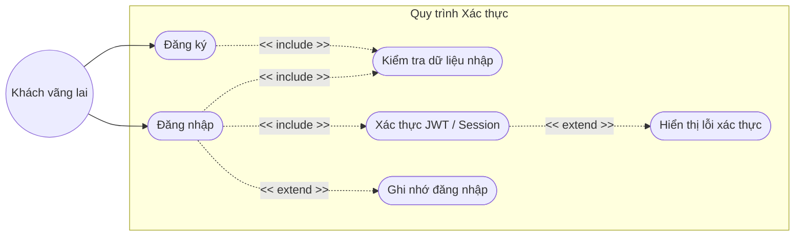

---

### 2. Phân rã: Quản lý Địa chỉ Giao hàng (Address Management)
Chi tiết cách người dùng quản lý thông tin nhận hàng.

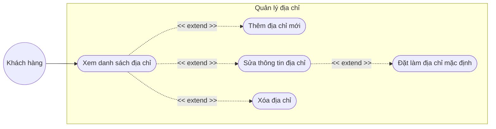

---

### 3. Phân rã: Tìm kiếm & Bộ lọc (Search & Filter)
Chi tiết hành vi tìm kiếm của khách hàng.

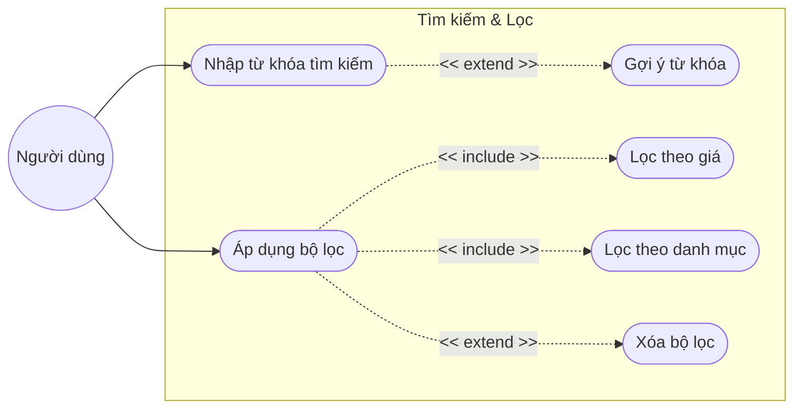

---

### 4. Phân rã: Xem chi tiết & Đánh giá (Product Detail & Reviews)
Tương tác sâu với nội dung sản phẩm.

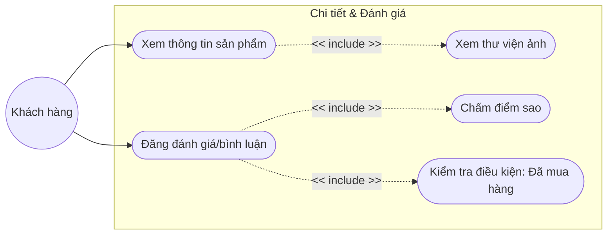

---

### 5. Phân rã: Quản lý Giỏ hàng (Cart Operations)
Các thao tác cập nhật giỏ hàng.

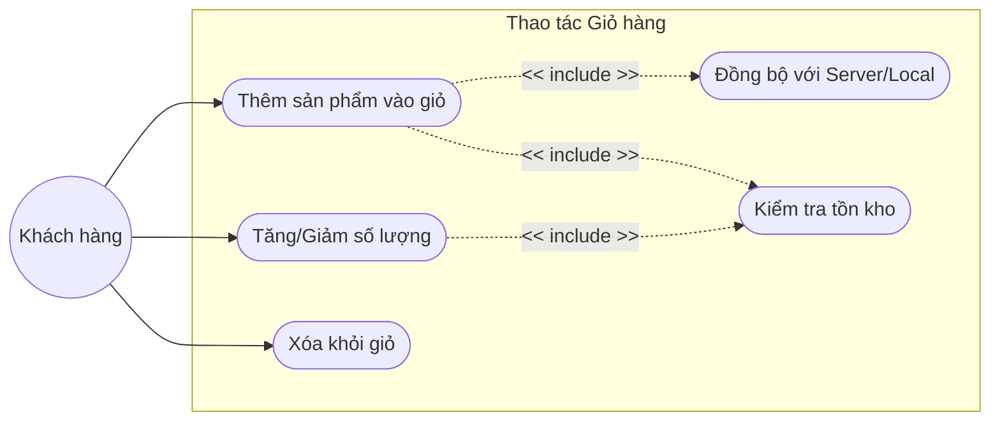

---

### 6. Phân rã: Quy trình Đặt hàng (Checkout Flow)
Quy trình từ giỏ hàng đến khi hoàn tất đơn.

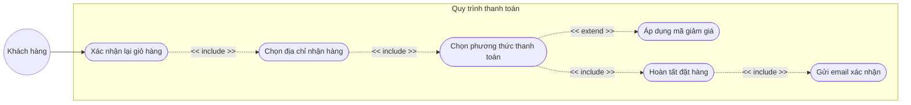

---

### 7. Phân rã: Quản trị Sản phẩm - CRUD (Admin Product)
Quy trình quản lý danh mục hàng hóa của Admin.

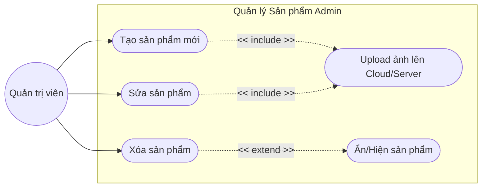

---

### 8. Phân rã: Import từ Excel (Excel Import Process)
Quy trình xử lý dữ liệu hàng loạt.

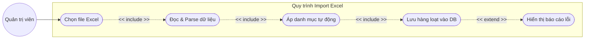

---

### 9. Phân rã: Quản lý Kho hàng (Stock Management)
Kiểm soát tồn kho sản phẩm.

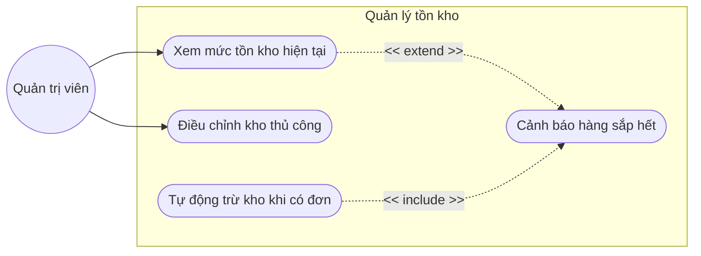

---

### 10. Phân rã: Quản lý Người dùng (User Management)
Admin kiểm soát tài khoản người dùng hệ thống.

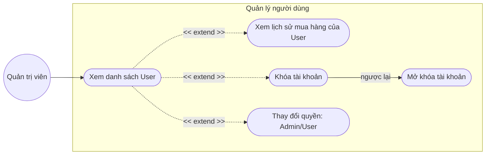

---

### 11. Phân rã: Xử lý Đơn hàng Admin (Order Processing)
Quy trình vận hành đơn hàng.

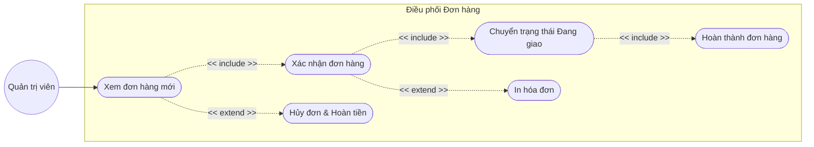

---

### 12. Phân rã: Quản lý Mã giảm giá (Coupon Management)
(Bổ sung thêm để báo cáo đầy đủ hơn).

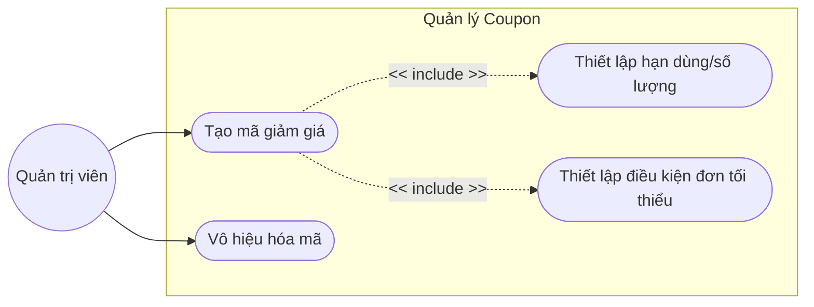

---

## Tổng kết
Báo cáo này đã thực hiện phân rã sâu nhất có thể cho từng tính năng đơn lẻ của dự án E_Commerce_MERN. Mỗi sơ đồ tập trung vào một quy trình hẹp, giúp nhà phát triển và người đọc báo cáo hiểu rõ từng bước logic và sự liên kết giữa các Use Case con.
