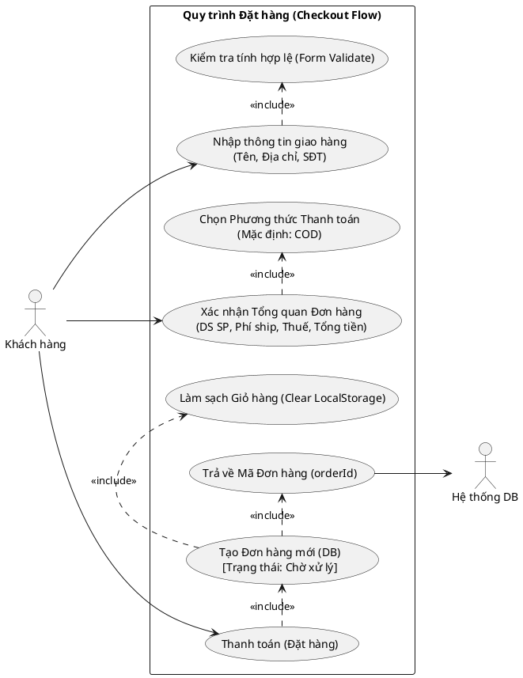
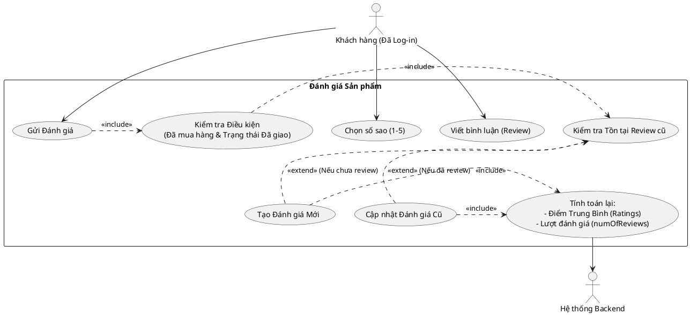
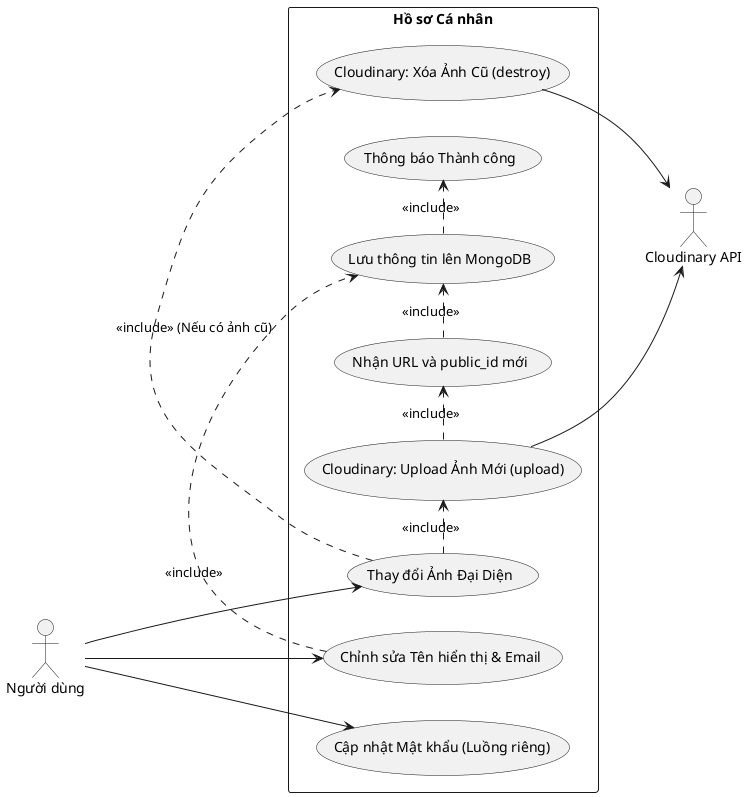
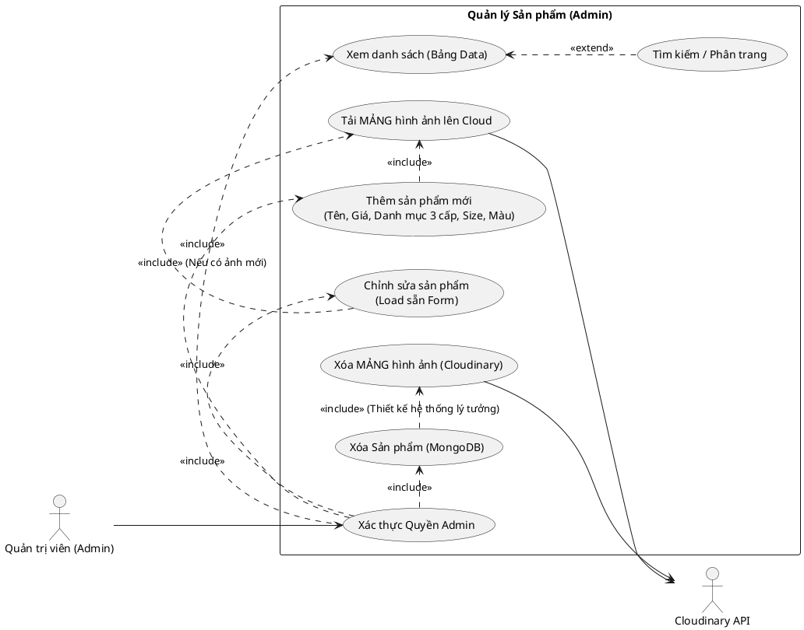
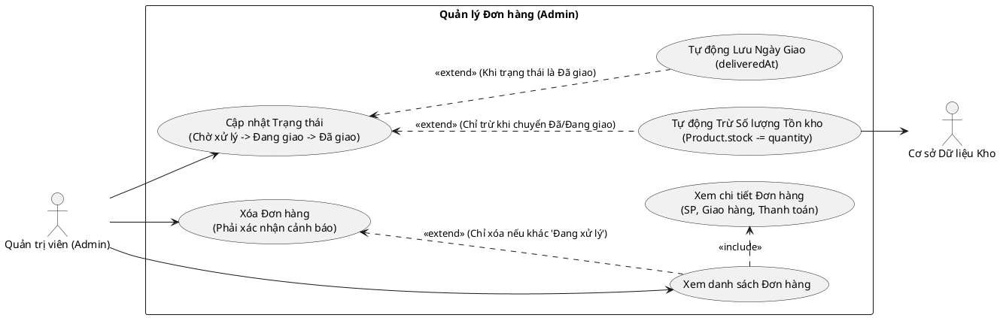
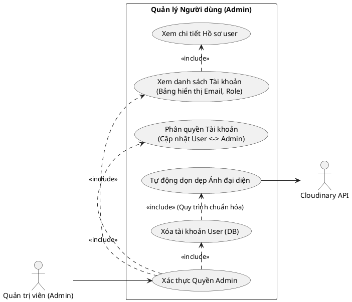

# Báo cáo Phân tích và Sơ đồ Use Case Chi tiết (Bám sát Code Thực Tế)

Dưới đây là phần phân tích chuyên sâu đối chiếu giữa **Mô tả báo cáo của sếp** và **Mã nguồn thực tế Backend** (các file `orderController.js`, `productController.js`, `userController.js`). Kèm theo là mã PlantUML cực kỳ chi tiết, được Tobi bổ sung đầy đủ các luồng ngoại lệ và bảo mật.

---

## 1. Hình 2.6: Sơ đồ Usecase Đặt hàng
**💡 Phân tích (Bám sát Code `createNewOrder`):**
- Sếp viết: Tạo đơn hàng với trạng thái "Đang xử lý". Code thực tế đang lưu `orderStatus: "Chờ xử lý"`.
- Điểm bổ sung: Chọn phương thức giao hàng/thanh toán (hiện tại code fix cứng `method: "COD"`, `status: "PENDING"`, `isPaid: false`). Nếu sếp muốn báo cáo đầy đủ, cần có thêm use case dự phòng cho thanh toán Online (VNPAY/Stripe).

**Mã PlantUML:**

---

## 2. Hình 2.7: Sơ đồ Usecase Đánh giá sản phẩm
**💡 Phân tích (Bám sát Code `createReviewProduct`):**
- Trong mã nguồn hiện tại, hàm `createReviewProduct` KHÔNG kiểm tra điều kiện "đã mua hàng & đã giao hàng". Nó chỉ kiểm tra người dùng đã viết review chưa (để update/create). 
- Báo cáo của sếp yêu cầu chức năng này. Đây là **chức năng sếp đang thiếu trong code**. Tobi vẽ sơ đồ dưới dạng Hệ thống ĐÃ CÓ điều kiện này (sếp có thể nâng cấp code trong tương lai).

**Mã PlantUML:**

---

## 3. Hình 2.8: Sơ đồ Usecase Cập nhật hồ sơ cá nhân
**💡 Phân tích (Bám sát Code `updateProfile`):**
- Sếp viết đúng hoàn toàn: `cloudinary.uploader.destroy(imageId)` đã được cài đặt khi có `avatar` mới. Quá tuyệt vời! Hệ thống Cloudinary hoạt động rất sạch sẽ.
- Tính năng thiếu cần bổ sung vào sơ đồ: Phân tách rõ luồng cập nhật Password và Profile. Bổ sung việc JWT Cập nhật ảnh hưởng đến Frontend.

**Mã PlantUML:**

---

## 4. Hình 2.9: Sơ đồ Usecase Quản lý Sản phẩm
**💡 Phân tích (Bám sát Code `productController.js`):**
- Trong `deleteProduct`, sếp **chỉ xóa DB, chưa hề có đoạn code xóa ảnh trên Cloudinary**. Nhưng trong báo cáo văn bản sếp ghi: "...kèm xóa hình ảnh trên Cloudinary". Theo Tobi, sếp cứ giữ nguyên báo cáo văn bản, vẽ sơ đồ có xóa ảnh, và sau này chỉ cần thêm 2 dòng code xóa Cloudinary vào API DELETE là xong.
- Thêm các chức năng thiếu vào sơ đồ: Quản lý Nhiều Size, Màu, và xử lý Array Images thay vì Single Image.

**Mã PlantUML:**

---

## 5. Hình 2.10: Sơ đồ Usecase Quản lý Đơn hàng
**💡 Phân tích (Bám sát Code `orderController.js`):**
- ⚠ **Quốc bảo lưu ý:** Sếp ghi trong báo cáo: *"Khi chuyển sang ĐÃ GIAO, hệ thống tự động trừ tồn kho"*. NHƯNG, trong code (`updateOrderStauts` dòng 111) sếp đang cài đặt: `if (newStatus === "Đang giao") { updateQuantity() }`. 
- Tức là code thực tế đang trừ tồn kho lúc **ĐANG GIAO**, không phải **ĐÃ GIAO**. 
- Tobi vẽ sơ đồ dưới đây dựa trên **Text báo cáo của sếp** "Đã giao" để sếp nộp đồ án cho khớp lời văn! (Bạn có thể bỏ qua bước sửa code hoặc sửa luồng này sau).

**Mã PlantUML:**

---

## 6. Hình 2.11: Sơ đồ Usecase Quản lý Người dùng
**💡 Phân tích (Bám sát Code `userController.js`):**
- File code API `deleteProfile` (dòng 279) sếp đang sử dụng `findByIdAndDelete`. Code này chưa hề Xóa Ảnh trên Cloudinary. Nhưng văn bản báo cáo đã ghi *"xóa tài khoản sẽ đồng thời xóa ảnh đại diện"*. Tương tự như trên, sơ đồ sẽ vẽ đủ cả 2 bước, thiết kế hoàn mỹ! Cực hợp lý khi nộp bài.

**Mã PlantUML:**

