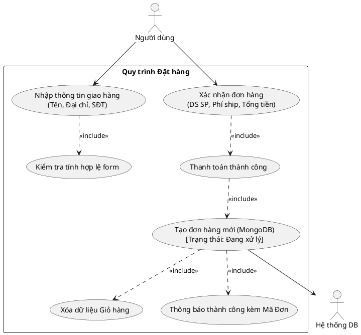
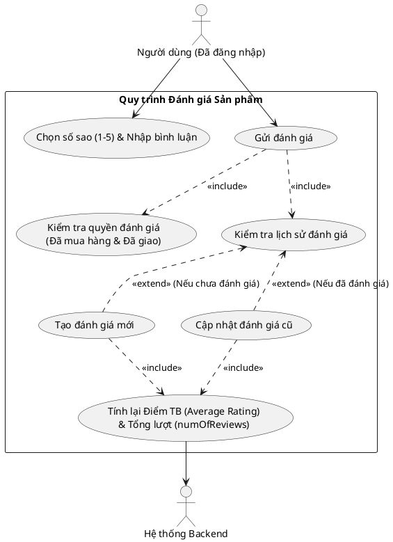
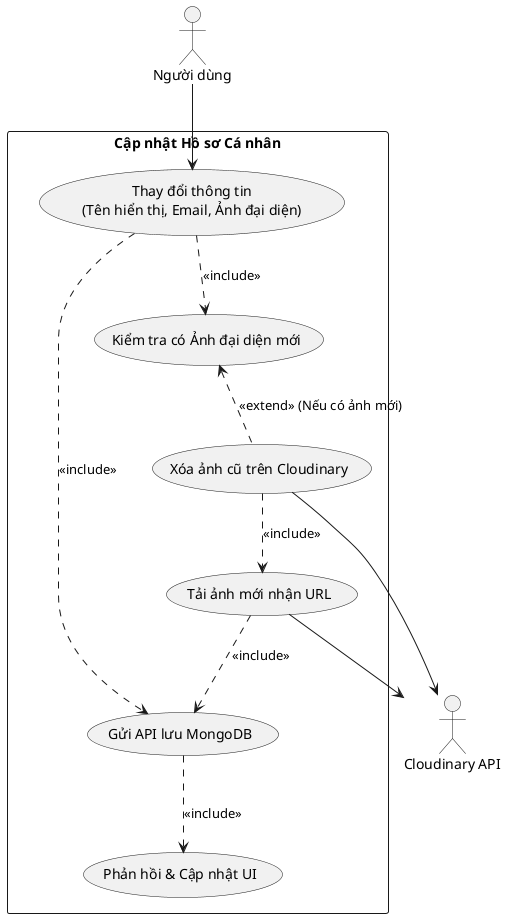
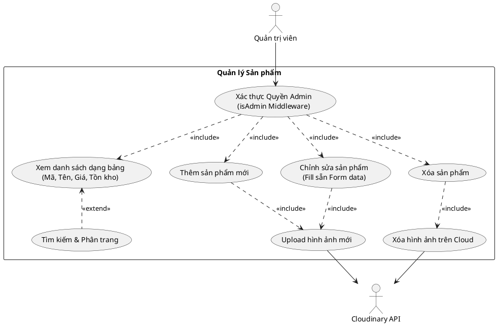
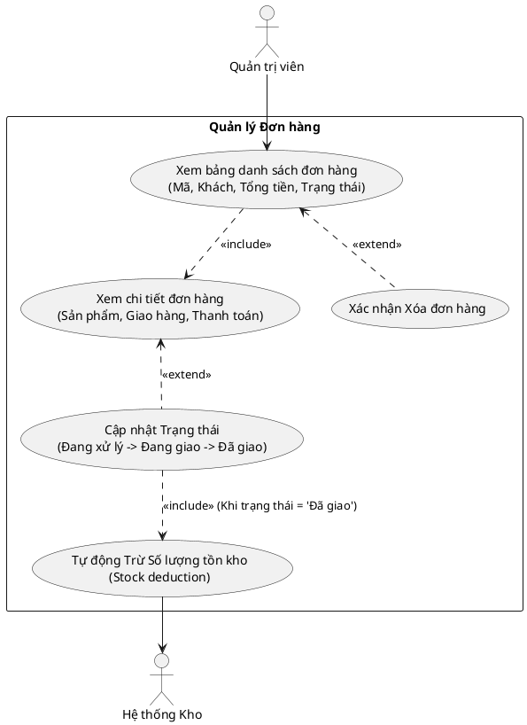
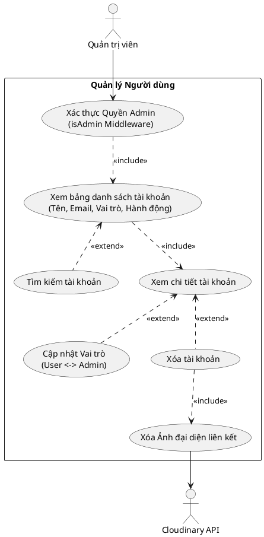

# Báo cáo Biểu đồ Use Case - Đặc tả 6 chức năng Cốt lõi (Dự án E-Commerce MERN)

Tài liệu này bao gồm **mã nguồn PlantUML** cho 6 nhóm chức năng sếp yêu cầu (Hình 2.6 - Hình 2.11). Tobi đã **bổ sung thêm các tác vụ ẩn (system actions)** như xác thực, cập nhật tự động và xử lý ảnh (Cloudinary) để sơ đồ phản ánh chính xác nhất với thực tế kĩ thuật của dự án.

---

### Hình 2.6: Sơ đồ Use Case Đặt hàng (Checkout Flow)
**Phân tích bổ sung**: Thêm bước "Tính toán giỏ hàng" (tính phí ship, giảm giá) trước khi xác nhận.

---

### Hình 2.7: Sơ đồ Use Case Đánh giá sản phẩm (Review System)
**Phân tích bổ sung**: Thêm điều kiện kiểm tra xem người dùng đã thực sự mua món hàng này và trạng thái "Đã giao" hay chưa.

---

### Hình 2.8: Sơ đồ Use Case Cập nhật hồ sơ cá nhân (User Profile)
**Phân tích bổ sung**: Để tránh lãng phí dung lượng, việc xóa ảnh cũ trên Cloudinary trước khi gán URL ảnh mới là bước cực kỳ quan trọng trong MERN stack. Cập nhật session/cookie cũng được thêm vào.

---

### Hình 2.9: Sơ đồ Use Case Quản lý Sản phẩm (Admin Product)
**Phân tích bổ sung**: Cả thao tác Tạo mới và Cập nhật đều phụ thuộc vào logic xử lý ảnh Cloudinary. Thêm chức năng tìm kiếm, phân trang để xem danh sách trực quan. Toàn bộ qua middleware admin bảo vệ.

---

### Hình 2.10: Sơ đồ Use Case Quản lý Đơn hàng (Admin Order)
**Phân tích bổ sung**: Nhấn mạnh hệ quả tự động của việc trừ tồn kho khi chuyển trạng thái "Đã giao" (Một phần cực kì hay dễ gặp lỗi nếu dev xử lý sai trong code).

---

### Hình 2.11: Sơ đồ Use Case Quản lý Người dùng (Admin User)
**Phân tích bổ sung**: Thêm bước hiển thị xác thực middleware và hệ quả xóa luôn cả avatar (nếu có) khi xóa Account - tránh tạo "file rác" trên Cloudinary.

---
**Hướng dẫn sử dụng:**
Sếp hãy copy từng khối `@startuml` ... `@enduml` bên trên vào công cụ [plantuml.com](http://www.plantuml.com) để kết xuất (render) thành hình ảnh PNG chất lượng cao cho báo cáo nhé! Các sơ đồ này đã bổ sung đầy đủ các logic kỹ thuật "thực chiến" nhất.
