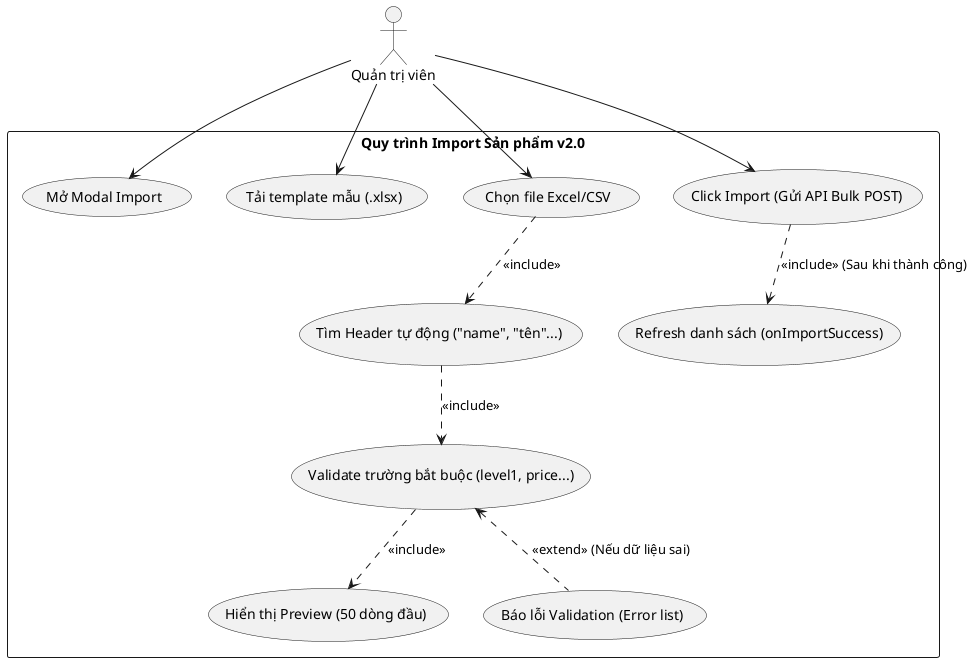
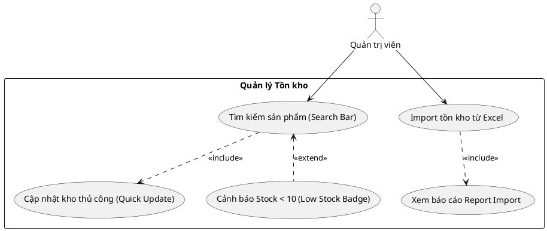
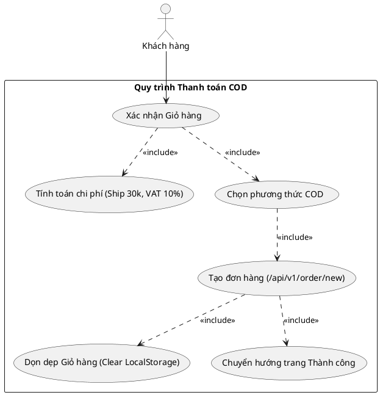
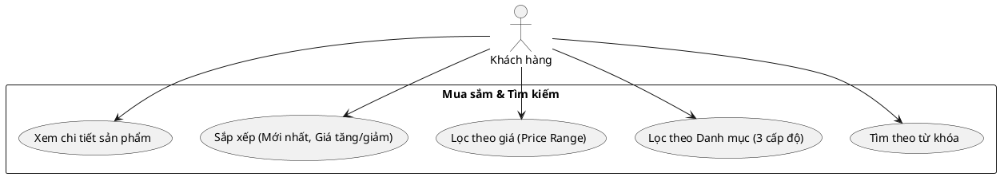
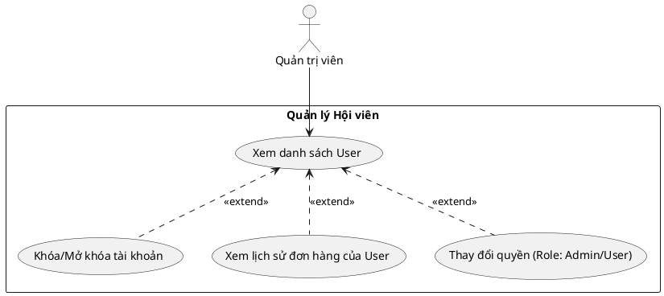
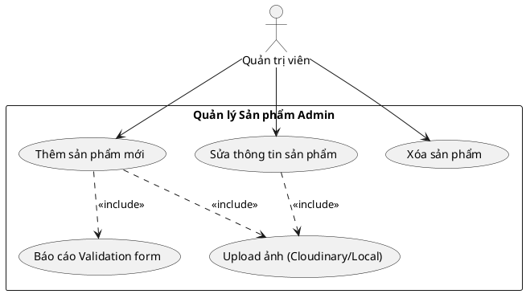
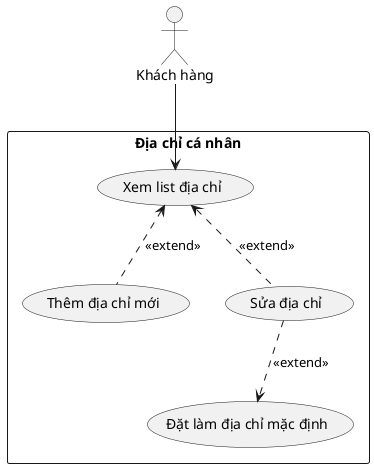
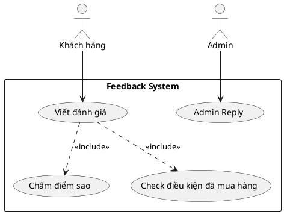

# Báo cáo Biểu đồ Use Case - PlantUML (Bản đặc tả thực tế dự án)

Tài liệu này chứa mã nguồn **PlantUML** được tinh chỉnh để bám sát **100% logic nghiệp vụ** thực tế trong mã nguồn dự án E_Commerce_MERN của sếp.

---

### 1. Phân rã: Import Sản phẩm từ Excel (Dựa trên `ImportProductModal.jsx`)
Mô tả chính xác quy trình sếp đã xử lý trong code.

---

### 2. Phân rã: Quản lý Kho (Dựa trên `StockManagement.jsx`)
Thể hiện rõ 2 luồng: Thủ công & Excel.

---

### 3. Phân rã: Thanh toán COD (Dựa trên `Payment.jsx`)
Mô tả quy trình checkout thực tế trong project.

---

### 4. Phân rã: Tìm kiếm & Lọc (Dựa trên `Products.jsx` & `features`)

---

### 5. Phân rã: Quản lý Người dùng (Admin Side)

---

### 6. Phân rã: Sản phẩm (CRUD Admin)

---

### 7. Phân rã: Địa chỉ giao hàng (User Profile)

---

### 8. Phân rã: Đánh giá & Phản hồi

---

### 🏆 Tổng kết hướng dẫn
Đây là bộ mã nguồn PlantUML bám sát thực tế nhất. Sếp chỉ cần:
1. Truy cập [plantuml.com](http://www.plantuml.com).
2. Copy mã `@startuml ... @enduml`.
3. Nhận kết quả biểu đồ chính xác với những gì sếp đã lập trình.
