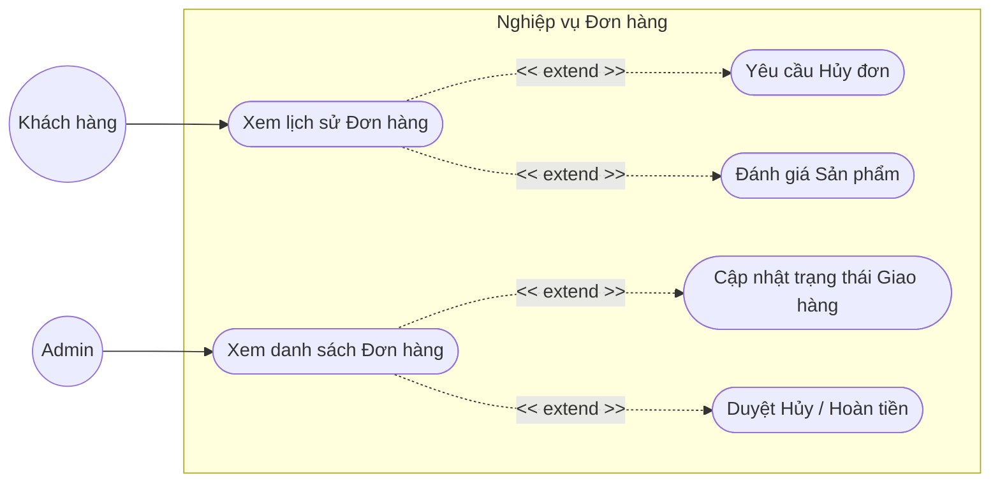
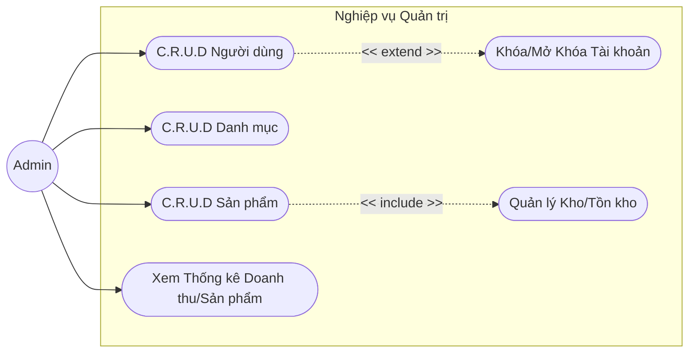
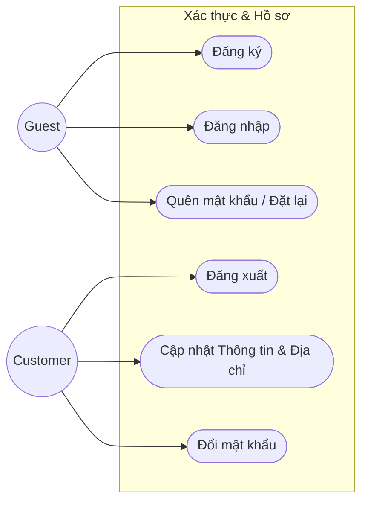

# Báo cáo Sơ đồ Use Case Phân rã - Dự án E-Commerce MERN

## 1. Sơ đồ Use Case Tổng quát (High-level)
Sơ đồ này thể hiện cái nhìn tổng quan nhất về hệ thống E-Commerce, bao gồm 3 tác nhân chính: **Khách vãng lai**, **Khách hàng (đã đăng ký)**, và **Quản trị viên (Admin)**.

```mermaid
flowchart LR
    %% Actors
    Guest((Guest\nKhách vãng lai))
    Customer((Customer\nKhách hàng))
    Admin((Admin\nQuản trị viên))

    %% System Boundary
    subgraph System [Hệ thống E-Commerce MERN]
        direction TB
        UC1([Quản lý Tài khoản / Xác thực])
        UC2([Mua sắm & Giỏ hàng])
        UC3([Quản lý Đơn hàng])
        UC4([Quản lý Cửa hàng & Hệ thống])
        UC5([Báo cáo & Thống kê])
    end

    Guest --> UC1
    Guest --> UC2
    
    Customer --> UC1
    Customer --> UC2
    Customer --> UC3

    Admin --> UC1
    Admin --> UC3
    Admin --> UC4
    Admin --> UC5

    %% Inheritance / Relationship
    Customer -.-|> Guest
```

---

## 2. Phân rã: Mua sắm & Thanh toán (Shopping & Checkout)
Đây là quy trình lõi của hệ thống ảnh hưởng trực tiếp đến doanh thu. Use case phân rã chi tiết hành vi từ lúc khách tìm kiếm đến khi hoàn tất thanh toán.

```mermaid
flowchart LR
    Customer((Khách hàng))
    Guest((Khách vãng lai))

    subgraph MuaSam [Chức năng Mua sắm & Giỏ hàng]
        direction TB
        Search([Tìm kiếm sản phẩm])
        Filter([Lọc & Sắp xếp sản phẩm])
        Detail([Xem chi tiết sản phẩm])
        Cart([Thêm vào Giỏ hàng])
        ManageCart([Quản lý Giỏ hàng])
        Checkout([Tiến hành Thanh toán ảo/thực])
        ApplyCoupon([Áp dụng Mã giảm giá])
        Payment([Chon phương thức thanh toán])
    end

    Guest --> Search
    Guest --> Filter
    Guest --> Detail
    Guest --> Cart
    Guest --> ManageCart

    Customer --> Checkout
    Customer --> ApplyCoupon

    Checkout ..-> |<< include >>| Payment
    Checkout ..-> |<< include >>| ManageCart
    Customer -.-|> Guest
```

---

## 3. Phân rã: Quản lý Đơn hàng (Order Management)
Đơn hàng là nơi Khách hàng và Quản trị viên tương tác gián tiếp với nhau. Khách hàng theo dõi đơn, Admin phê duyệt và cập nhật trạng thái.



---

## 4. Phân rã: Quản lý Cửa hàng & Hệ thống (Admin Only)
Góc nhìn dành riêng cho Admin để vận hành dữ liệu cốt lõi (sản phẩm, kho, danh mục, người dùng).



---

## 5. Phân rã: Quản lý Tài khoản (Account Management)
Mô phỏng các Use case liên quan đến hồ sơ cá nhân và quy trình xác thực.



---

## Tổng kết (Summary)
Báo cáo phân rã Use Case trên đây bao quanh các thành phần chính của một dự án E-Commerce tiêu chuẩn, được thiết kế dưới dạng Mermaid để dễ dàng chỉnh sửa hoặc bổ sung bằng văn bản thuần túy với khả năng hiển thị tương tác trên các nền tảng hỗ trợ Markdown như GitHub.
