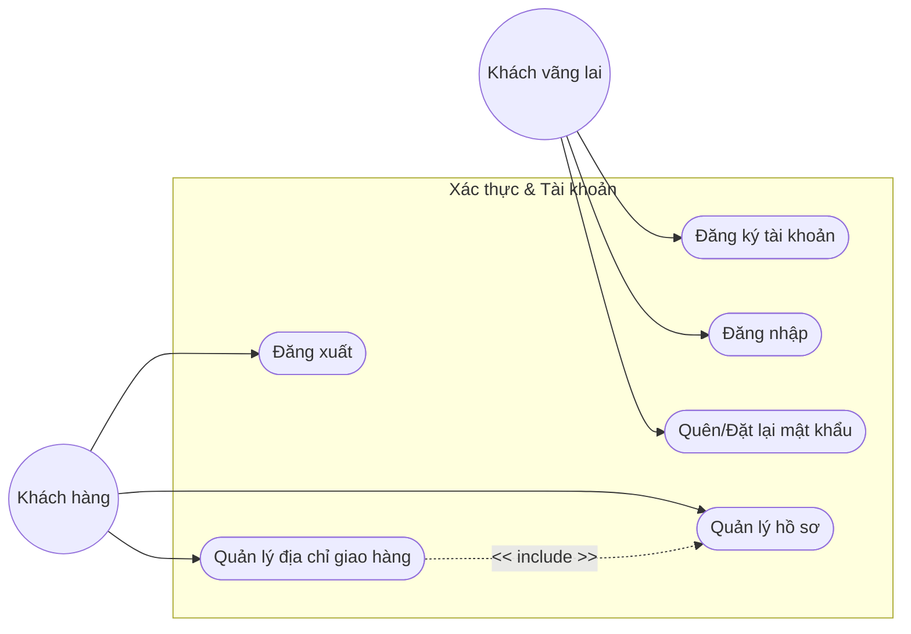
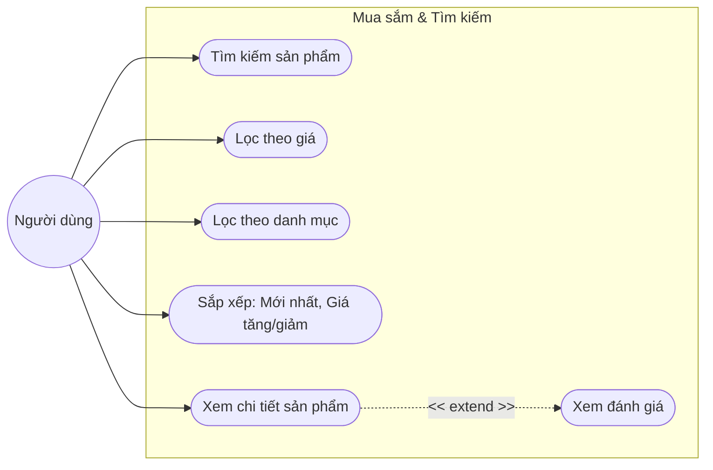
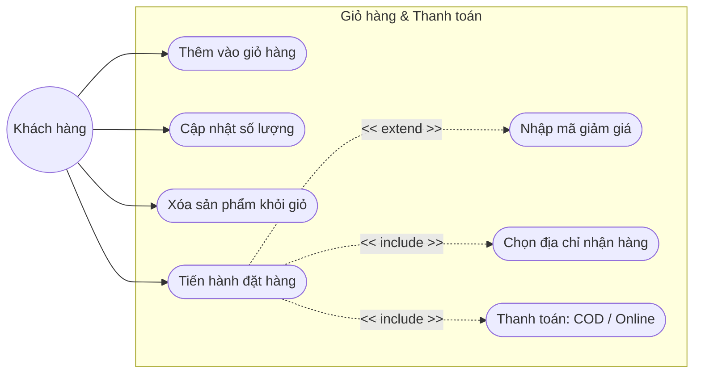
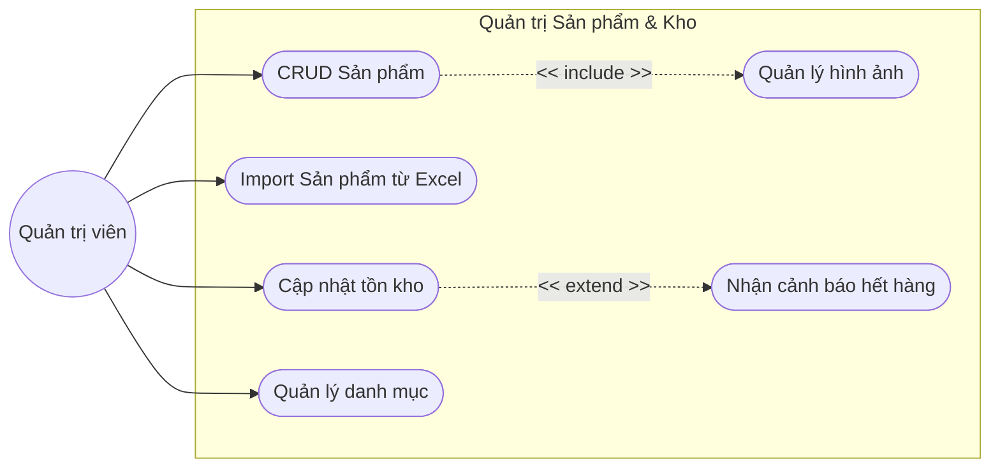
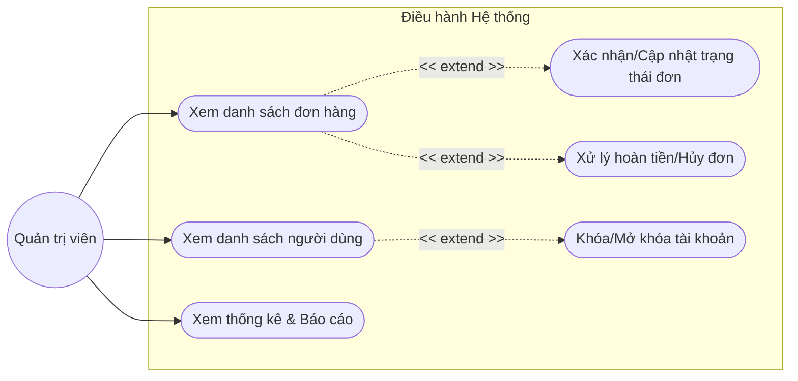
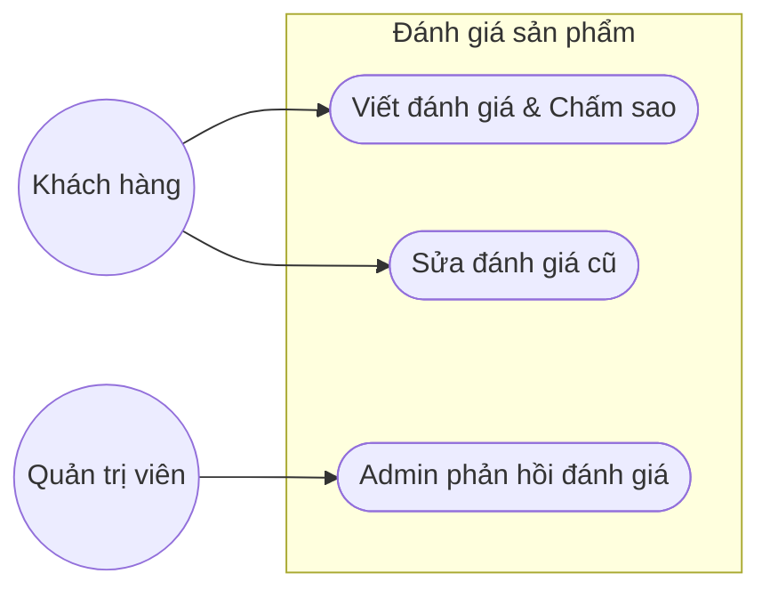

# Báo cáo Chi tiết Biểu đồ Use Case cho từng Chức năng

Tài liệu này cung cấp các sơ đồ Use Case phân rã chi tiết cho từng mô-đun chức năng trong dự án E-Commerce MERN, dựa trên việc phân tích mã nguồn thực tế (Backend Routes & Frontend Components).

---

## 1. Nhóm chức năng: Xác thực & Người dùng (Authentication & User)
Mô-đun này xử lý quyền truy cập và thông tin cá nhân.

---

## 2. Nhóm chức năng: Mua sắm & Sản phẩm (Product & Shopping)
Phân rã các hành động tương tác với danh mục hàng hóa.

---

## 3. Nhóm chức năng: Giỏ hàng & Thanh toán (Cart & Checkout)
Quy trình nghiệp vụ quan trọng nhất đối với khách hàng.

---

## 4. Nhóm chức năng: Quản trị Sản phẩm & Kho (Admin Product & Stock)
Dành cho Quản trị viên quản lý hàng hóa và dữ liệu Excel.

---

## 5. Nhóm chức năng: Quản trị Đơn hàng & Người dùng (Admin Orders & Users)
Dành cho Quản trị viên điều hành hệ thống.

---

## 6. Nhóm chức năng: Đánh giá & Phản hồi (Reviews & Feedback)
Tương tác giữa khách hàng và sản phẩm.

---

## Kết luận
Bộ sơ đồ Use Case trên đã bao phủ toàn bộ các chức năng từ Client (Khách hàng) đến Admin (Quản trị) dựa trên cấu trúc thực tế của dự án E_Commerce_MERN. Tài liệu sử dụng Mermaid JS giúp sếp dễ dàng nhúng vào báo cáo hoặc trình bày trực quan.
