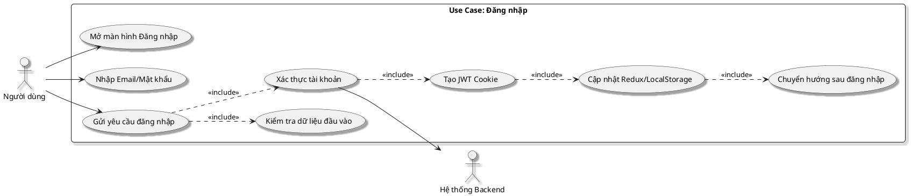

# Đặc tả Use Case: Đăng nhập

Tài liệu này đặc tả chức năng đăng nhập của dự án `E_Commerce_MERN` dựa trên luồng triển khai thực tế ở frontend React, Redux Toolkit và backend Node.js/Express.

## 1. Thông tin Use Case

| Thuộc tính | Mô tả |
| :--- | :--- |
| **Tên Use Case** | Đăng nhập |
| **Mã Use Case** | UC-AUTH-LOGIN |
| **Tác nhân** | Người dùng chưa đăng nhập |
| **Mục tiêu** | Cho phép người dùng đăng nhập vào hệ thống bằng email và mật khẩu để sử dụng các chức năng cá nhân như hồ sơ, đặt hàng, thanh toán và theo dõi đơn hàng. |
| **Phạm vi** | Frontend React, Redux Toolkit, Backend Express, MongoDB, JWT Cookie |
| **Kích hoạt** | Người dùng mở trang `/login` hoặc bị chuyển hướng từ một trang yêu cầu đăng nhập. |
| **Tiền điều kiện** | Hệ thống hoạt động bình thường; người dùng đã có tài khoản hợp lệ; cơ sở dữ liệu và API đăng nhập sẵn sàng. |
| **Hậu điều kiện thành công** | Hệ thống tạo phiên đăng nhập hợp lệ bằng JWT trong cookie `httpOnly`; cập nhật trạng thái đăng nhập ở Redux và `localStorage`; điều hướng người dùng đến trang chủ hoặc trang được yêu cầu trước đó. |
| **Hậu điều kiện thất bại** | Không tạo phiên đăng nhập; người dùng vẫn ở màn hình đăng nhập; hệ thống hiển thị thông báo lỗi phù hợp. |

## 2. Sơ đồ Use Case phân rã

## 3. Luồng sự kiện chính

1. Người dùng truy cập màn hình `Đăng nhập`.
2. Hệ thống hiển thị form gồm các trường `Email Address` và `Password`, nút đăng nhập, liên kết `Forgot password?` và các nút giao diện Google/Facebook.
3. Người dùng nhập email và mật khẩu.
4. Người dùng nhấn nút `Sign in to account`.
5. Frontend gửi yêu cầu `POST /api/v1/login` kèm `email` và `password`.
6. Backend kiểm tra dữ liệu đầu vào:
   - Không được để trống email hoặc mật khẩu.
   - Tìm người dùng theo email trong cơ sở dữ liệu.
   - So khớp mật khẩu nhập vào với mật khẩu đã mã hóa trong MongoDB.
7. Nếu thông tin hợp lệ, backend tạo JWT, ghi cookie `token` và trả về thông tin người dùng.
8. Frontend cập nhật `user`, `isAuthenticated`, `success` trong Redux và lưu trạng thái xác thực vào `localStorage`.
9. Hệ thống hiển thị thông báo đăng nhập thành công.
10. Người dùng được điều hướng:
    - Về trang đã yêu cầu trước đó nếu có tham số `redirect`.
    - Hoặc về trang chủ `/` nếu không có `redirect`.
11. Kết thúc use case.

## 4. Luồng thay thế và ngoại lệ

### 4.1. Thiếu email hoặc mật khẩu

1. Người dùng bỏ trống một trong hai trường hoặc cả hai trường.
2. Frontend vẫn gửi yêu cầu đăng nhập.
3. Backend từ chối xử lý và trả về lỗi.
4. Hệ thống hiển thị thông báo lỗi cho người dùng.
5. Người dùng quay lại bước nhập thông tin.

### 4.2. Email không tồn tại

1. Người dùng nhập email chưa đăng ký trong hệ thống.
2. Backend không tìm thấy tài khoản tương ứng.
3. Hệ thống trả về lỗi xác thực.
4. Frontend hiển thị thông báo lỗi.
5. Người dùng quay lại bước nhập thông tin.

### 4.3. Mật khẩu không chính xác

1. Người dùng nhập đúng email nhưng sai mật khẩu.
2. Backend kiểm tra mật khẩu và xác định không khớp.
3. Hệ thống trả về lỗi xác thực.
4. Frontend hiển thị thông báo lỗi.
5. Người dùng quay lại bước nhập thông tin.

### 4.4. Truy cập trang yêu cầu xác thực khi chưa đăng nhập

1. Người dùng truy cập các trang được bảo vệ như hồ sơ, thanh toán, đơn hàng.
2. Middleware hoặc `ProtectedRoute` phát hiện chưa có phiên đăng nhập hợp lệ.
3. Hệ thống chuyển người dùng về màn hình đăng nhập.
4. Trong một số luồng như thanh toán, hệ thống đính kèm tham số `redirect` để quay lại đúng trang sau khi đăng nhập thành công.

### 4.5. Lỗi mạng hoặc lỗi máy chủ

1. Yêu cầu đăng nhập không thể hoàn tất do lỗi mạng hoặc lỗi backend.
2. Frontend nhận lỗi và hiển thị thông báo thất bại.
3. Người dùng vẫn ở màn hình đăng nhập để thử lại.

## 5. Quy tắc nghiệp vụ

1. Đăng nhập hiện tại của dự án được triển khai bằng **email và mật khẩu**.
2. Mật khẩu người dùng được mã hóa bằng `bcryptjs` trước khi lưu trong cơ sở dữ liệu.
3. Phiên đăng nhập được tạo bằng JWT và lưu trong cookie `httpOnly`.
4. Frontend sử dụng Redux để quản lý trạng thái đăng nhập và dùng `localStorage` để duy trì trạng thái giao diện khi tải lại trang.
5. Nếu người dùng đã đăng nhập mà truy cập lại `/login`, hệ thống sẽ điều hướng họ đến trang đích phù hợp.

## 6. Phạm vi hiện tại và ghi chú mở rộng

- Trong phiên bản hiện tại, dự án **chưa triển khai thực tế** luồng đăng nhập bằng Google/Facebook ở backend.
- Màn hình đăng nhập đã có nút giao diện Google và Facebook, nhưng chưa có API OAuth, chưa có xử lý nhận token từ nhà cung cấp danh tính và chưa có luồng ghép tài khoản nội bộ.
- Vì vậy, trong đặc tả use case chính thức của dự án hiện tại, chức năng đăng nhập nên được mô tả là **đăng nhập bằng email/mật khẩu**.
- Nếu sau này bổ sung OAuth, có thể mở rộng thêm một use case phụ: `Đăng nhập với nhà cung cấp danh tính`.

## 7. Ánh xạ với mã nguồn

- Frontend màn hình đăng nhập: `frontend/src/User/Login.jsx`
- Redux xử lý đăng nhập: `frontend/src/features/user/userSlice.js`
- API route đăng nhập: `backend/routes/userRoutes.js`
- Controller đăng nhập: `backend/controllers/userController.js`
- Tạo JWT cookie: `backend/utils/jwtToken.js`
- Middleware kiểm tra đăng nhập: `backend/middleware/userAuth.js`
