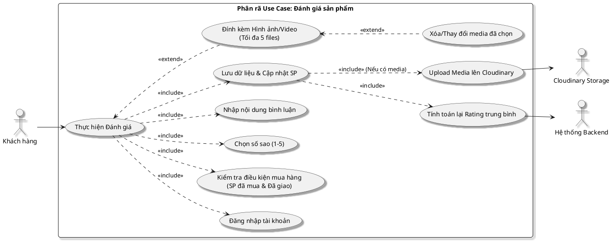

# Phân rã sơ đồ Use Case: Đánh giá sản phẩm (Bản cập nhật Media)

Sơ đồ này mô tả chi tiết các bước trong quy trình người dùng đánh giá sản phẩm, bao gồm các ràng buộc về quyền sở hữu và khả năng đính kèm phương tiện truyền thông (Hình ảnh/Video).

## Hình 2.7: Sơ đồ Use Case Phân rã Đánh giá Sản phẩm

### 1. Sơ đồ PlantUML

### 2. Mô tả chi tiết các thành phần

| Thành phần | Mô tả |
| :--- | :--- |
| **Actor chính** | **Khách hàng**: Người dùng đã đăng nhập và đã hoàn thành việc mua sản phẩm. |
| **Actor hỗ trợ** | **Cloudinary**: Lưu trữ tệp media. **Backend**: Tính toán logic và lưu DB. |
| **Tiền điều kiện** | Người dùng phải đăng nhập. Sản phẩm đánh giá phải nằm trong đơn hàng có trạng thái "Đã giao". |
| **Hậu điều kiện** | Đánh giá được lưu thành công. Điểm trung bình sao của sản phẩm được cập nhật. |

### 3. Các bước thực hiện (Basic Flow)
1. **Người dùng** mở trang chi tiết sản phẩm hoặc danh sách đơn hàng đã mua.
2. Hệ thống kiểm tra **Đăng nhập** và **Lịch sử mua hàng** (Include).
3. Người dùng chọn số sao từ 1 đến 5 (Include).
4. Người dùng nhập nội dung bình luận (Include).
5. (Tùy chọn) Người dùng tải lên tối đa 5 hình ảnh hoặc video minh họa (Extend).
6. Khi xác nhận "Hoàn thành", hệ thống:
   - Tải media lên Cloudinary và lấy URL (Include).
   - Lưu toàn bộ thông tin (sao, cmt, media urls) vào MongoDB (Include).
   - Tự động gọi hàm tính toán lại điểm rating trung bình của sản phẩm (Include).

### 4. Luồng ngoại lệ (Exception Flow)
- **Chưa mua hàng**: Hệ thống hiển thị thông báo lỗi "Bạn chỉ có thể đánh giá sản phẩm sau khi đã mua và nhận hàng thành công".
- **File quá lớn/Sai định dạng**: Hệ thống báo lỗi và yêu cầu chọn lại file.
- **Lỗi kết nối**: Thông báo cho người dùng thử lại sau.
