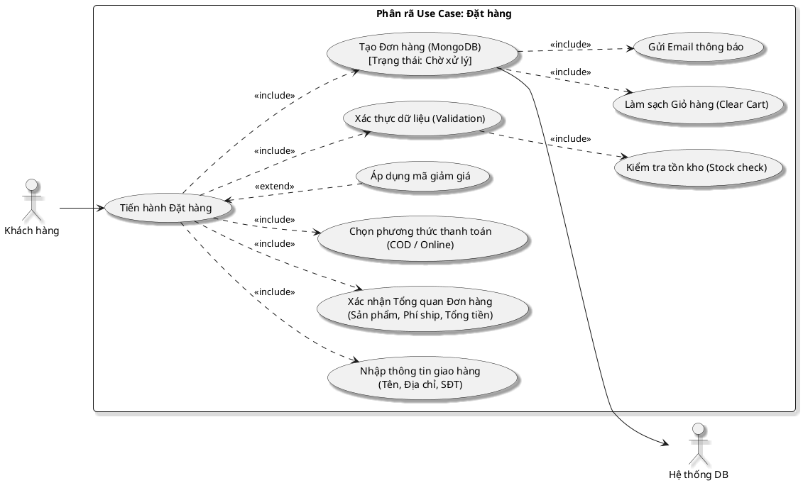

# Phân rã sơ đồ Use Case: Đặt hàng (Checkout Flow)

Sơ đồ này mô tả chi tiết quy trình từ khi khách hàng bắt đầu thanh toán giỏ hàng cho đến khi đơn hàng được tạo thành công trong hệ thống.

## Hình 2.6: Sơ đồ Use Case Phân rã Đặt hàng

### 1. Sơ đồ PlantUML

### 2. Đặc tả Use Case chi tiết

| Đặc tính | Nội dung |
| :--- | :--- |
| **Tên Use Case** | Đặt hàng |
| **Actor** | Khách hàng (User) |
| **Mục tiêu** | Chuyển đổi giỏ hàng thành đơn hàng chính thức trong hệ thống. |
| **Tiền điều kiện** | Có ít nhất một sản phẩm trong giỏ hàng. |

### 3. Luồng sự kiện chính (Main Flow)
1. **Khách hàng** nhấn nút "Thanh toán" từ giỏ hàng.
2. **Hệ thống** yêu cầu nhập thông tin giao hàng (Include).
3. Người dùng nhập tên, địa chỉ, số điện thoại.
4. **Hệ thống** kiểm tra tính hợp lệ của thông tin và kiểm tra tồn kho (Include).
5. Người dùng chọn phương thức thanh toán (COD là mặc định).
6. Người dùng xác nhận tổng tiền và nhấn "Đặt hàng".
7. **Hệ thống** lưu bản ghi đơn hàng vào MongoDB với trạng thái ban đầu là "Chờ xử lý" (Include).
8. **Hệ thống** xóa toàn bộ sản phẩm trong giỏ hàng hiện tại (Include).
9. **Hệ thống** gửi email xác nhận cho khách hàng (Include).

### 4. Luồng ngoại lệ & Sai lệch
- **Sản phẩm hết hàng**: Hệ thống báo lỗi và yêu cầu cập nhật lại giỏ hàng trước khi tiếp tục.
- **Thông tin giao hàng thiếu**: Nút "Tiếp tục" bị vô hiệu hóa hoặc báo đỏ các trường còn thiếu.
- **Mã giảm giá không hợp lệ**: Hệ thống từ chối áp dụng và thông báo mã không tồn tại/hết hạn.
