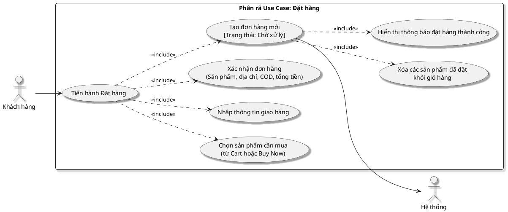

# Phân rã sơ đồ Use Case: Đặt hàng (Checkout Flow)

Sơ đồ này mô tả chi tiết quy trình đặt hàng theo đúng luồng hiện tại trong dự án E_Commerce_MERN, từ lúc người dùng chọn sản phẩm trong giỏ hàng, nhập thông tin giao hàng, xác nhận đơn hàng đến khi hệ thống tạo đơn thành công.

## Hình 2.6: Sơ đồ Use Case Phân rã Đặt hàng

### 1. Sơ đồ PlantUML

### 2. Đặc tả Use Case chi tiết

| Thuộc tính | Mô tả nội dung |
| :--- | :--- |
| **Tên Use Case** | Đặt hàng (Place Order) |
| **Tác nhân** | Người dùng (Thành viên đã đăng nhập) |
| **Mô tả** | Người dùng kiểm tra lại toàn bộ thông tin đơn hàng lần cuối tại màn hình xác nhận đơn hàng, sau đó thực hiện xác nhận để hệ thống tạo đơn hàng mới. |
| **Tiền điều kiện** | - Người dùng đã đăng nhập. - Người dùng có ít nhất một sản phẩm cần đặt mua từ giỏ hàng hoặc luồng `Mua ngay`. - Người dùng đã hoàn tất bước nhập thông tin giao hàng tại màn hình `Shipping`. - Hệ thống đã tính được tạm tính, thuế VAT và phí vận chuyển. |
| **Hậu điều kiện** | - Đơn hàng được tạo thành công trong cơ sở dữ liệu qua API `POST /api/v1/order/new`. - Đơn hàng mới có trạng thái `Chờ xử lý`. - Thông tin thanh toán mặc định lưu là `COD`, trạng thái thanh toán `PENDING`, `isPaid = false`. - Các sản phẩm vừa đặt bị xóa khỏi giỏ hàng hiện tại bằng action `removeOrderedItems`. - Hệ thống hiển thị popup đặt hàng thành công và mã đơn hàng; sau đó người dùng có thể đi tới trang `/orders/user`. |

### 3. Kịch bản

#### Trường hợp 1: Xác nhận và đặt hàng thành công
1. Từ trang giỏ hàng, người dùng chọn các sản phẩm muốn mua và nhấn nút tiến hành đặt hàng.
2. Nếu chưa đăng nhập, hệ thống điều hướng người dùng tới trang đăng nhập; nếu đã đăng nhập, hệ thống cho phép tiếp tục checkout.
3. Người dùng nhập thông tin giao hàng tại màn hình `Shipping`.
4. Hệ thống lưu thông tin giao hàng vào Redux store và `localStorage`, sau đó điều hướng đến màn hình `Xác nhận đơn hàng` (`/order/confirm`).
5. Hệ thống hiển thị tóm tắt đơn hàng gồm: thông tin khách hàng, địa chỉ nhận hàng, danh sách sản phẩm, số lượng, đơn giá, phương thức thanh toán COD, tạm tính, thuế VAT, phí vận chuyển và tổng cộng.
6. Người dùng kiểm tra thông tin và nhấn nút `Xác nhận đặt hàng`.
7. Frontend chuẩn bị payload đơn hàng từ `cartItems`, `shippingInfo`, thông tin tổng tiền và gửi request `POST /api/v1/order/new`.
8. Backend tiếp nhận request, tạo mới một bản ghi đơn hàng trong cơ sở dữ liệu với trạng thái `Chờ xử lý`.
9. Backend trả về phản hồi thành công, kèm `orderId` và dữ liệu đơn hàng vừa tạo.
10. Frontend xóa các sản phẩm vừa đặt khỏi giỏ hàng bằng `removeOrderedItems`, đồng thời xóa dữ liệu tạm trong `sessionStorage` như `directBuyItem` hoặc `selectedOrderItems`.
11. Hệ thống hiển thị popup `Đặt hàng thành công` và mã đơn hàng.
12. Người dùng đóng popup hoặc nhấn nút đi tới trang đơn hàng; hệ thống điều hướng đến `/orders/user`.
13. Kết thúc Use Case.

#### Trường hợp 2: Người dùng quay lại để chỉnh sửa trước khi đặt
1. Tại màn hình xác nhận đơn hàng, người dùng phát hiện thông tin chưa đúng.
2. Người dùng chọn quay lại giỏ hàng hoặc quay lại bước trước để chỉnh sửa thông tin giao hàng.
3. Hệ thống giữ lại dữ liệu đã lưu trong Redux và `localStorage`.
4. Sau khi chỉnh sửa xong, người dùng quay lại màn hình xác nhận đơn hàng.
5. Kết thúc Use Case.

### 4. Kịch bản thay thế và ngoại lệ

- **Trường hợp: Giỏ hàng trống**
  Hệ thống hiển thị thông báo lỗi `Giỏ hàng đang trống!` và không cho tạo đơn hàng.

- **Trường hợp: Thiếu thông tin giao hàng**
  Ở màn hình `Shipping`, nếu người dùng chưa nhập đủ địa chỉ, tỉnh/thành, quận/huyện, phường/xã hoặc số điện thoại không hợp lệ, hệ thống hiển thị thông báo lỗi và không cho chuyển sang bước xác nhận.

- **Trường hợp: Lỗi tạo đơn hàng từ API/Database**
  Nếu request `POST /api/v1/order/new` thất bại, hệ thống hiển thị thông báo `Đặt hàng thất bại. Vui lòng thử lại!` hoặc thông báo lỗi từ server; giỏ hàng hiện tại vẫn được giữ nguyên.

- **Trường hợp: Phiên đăng nhập hết hạn**
  Vì các màn `Shipping` và `Order Confirm` được bảo vệ bởi `ProtectedRoute`, nếu người dùng chưa xác thực hoặc phiên đăng nhập hết hạn, hệ thống điều hướng về trang đăng nhập trước khi cho tiếp tục checkout.

### 5. Lưu ý bám sát dự án

- Luồng checkout hiện tại gồm các bước chính: `Cart -> Shipping -> Order Confirm -> Popup Success -> Orders User`.
- Màn xác nhận đơn hàng hiện đang hiển thị phương thức thanh toán COD là mặc định.
- Dự án hiện **chưa** kiểm tra tồn kho ngay tại thời điểm tạo đơn hàng.
- Dự án hiện **chưa** trừ tồn kho khi tạo đơn; việc trừ tồn kho chỉ xảy ra khi admin cập nhật trạng thái đơn sang `Đang giao`.
- Dự án hiện **chưa** gửi email xác nhận đơn hàng ở luồng này.
- Dự án hiện **không** xóa toàn bộ giỏ hàng một cách mù; hệ thống chỉ xóa các sản phẩm vừa được đặt thành công khỏi giỏ hàng hiện tại.
