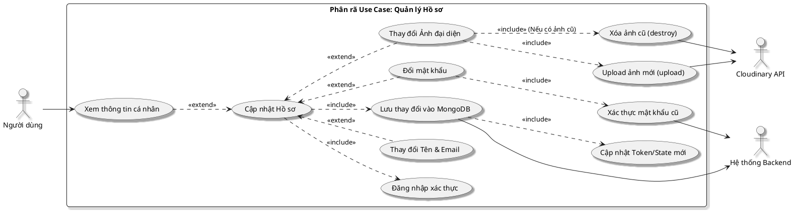

# Phân rã sơ đồ Use Case: Cập nhật hồ sơ cá nhân

Sơ đồ này mô tả chi tiết quy trình người dùng quản lý và cập nhật thông tin cá nhân của mình, bao gồm các thành phần quan trọng như xử lý hình ảnh và bảo mật mật khẩu.

## Hình 2.8: Sơ đồ Use Case Phân rã Cập nhật Hồ sơ

### 1. Sơ đồ PlantUML

### 2. Đặc tả Use Case chi tiết

| Đặc tính | Nội dung |
| :--- | :--- |
| **Tên Use Case** | Cập nhật hồ sơ cá nhân |
| **Actor** | Người dùng (User) |
| **Mục tiêu** | Cho phép người dùng thay đổi thông tin định danh, ảnh đại diện hoặc mật khẩu. |
| **Tiền điều kiện** | Người dùng đã đăng nhập thành công vào hệ thống. |

### 3. Luồng sự kiện chính (Main Flow)
1. **Người dùng** truy cập vào trang "Hồ sơ cá nhân".
2. **Hệ thống** hiển thị thông tin hiện tại (Tên, Email, Avatar).
3. Người dùng chọn chức năng "Chỉnh sửa hồ sơ".
4. Người dùng thực hiện một hoặc nhiều hành động sau:
   - Nhập Tên hoặc Email mới.
   - Chọn file ảnh mới để thay đổi Avatar.
   - Nhập mật khẩu cũ và mật khẩu mới để đổi pass.
5. Người dùng nhấn "Cập nhật".
6. **Hệ thống** thực hiện kiểm tra dữ liệu đầu vào (Validation).
7. Nếu có thay đổi **Avatar**:
   - Hệ thống gọi Cloudinary API để xóa ảnh cũ (ID cũ).
   - Hệ thống upload ảnh mới lên thư mục `avatars` trên Cloudinary.
8. Nếu có thay đổi **Mật khẩu**:
   - Hệ thống so khớp mật khẩu cũ trong DB.
   - Mã hóa (Hash) mật khẩu mới trước khi lưu.
9. **Hệ thống** cập nhật bản ghi trong MongoDB và trả về thông tin User mới.
10. Frontend cập nhật lại Redux state/Cookie để hiển thị thông tin mới nhất.

### 4. Luồng sai lệch & Ngoại lệ
- **Email đã tồn tại**: Hệ thống báo lỗi "Email đã được sử dụng bởi người dùng khác".
- **Mật khẩu cũ không khớp**: Hệ thống báo lỗi "Mật khẩu cũ không chính xác".
- **Lỗi Cloudinary**: Nếu việc tải ảnh thất bại, hệ thống sẽ dừng quy trình và yêu cầu người dùng thử lại.
