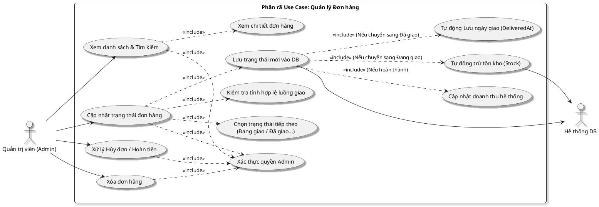

# Phân rã sơ đồ Use Case: Quản lý Đơn hàng (Admin)

Sơ đồ này chi tiết hóa các hành động của Admin khi điều phối đơn hàng và cập nhật tình trạng kinh doanh.

## Hình 2.10: Sơ đồ Use Case Phân rã Quản lý Đơn hàng

### 1. Sơ đồ PlantUML

### 2. Mô tả các bước nghiệp vụ

| Hành động | Chi tiết xử lý |
| :--- | :--- |
| **Xem & Tìm kiếm** | Admin sử dụng ID hoặc bộ lọc trạng thái để tìm đơn hàng cần xử lý. |
| **Cập nhật trạng thái** | Admin chọn trạng thái -> Hệ thống kiểm tra điều kiện (vd: Không thể hủy đơn đã giao) -> Lưu vào MongoDB. |
| **Trừ tồn kho** | Khi chuyển sang "Đang giao", hệ thống tự động trừ `Stock` của từng sản phẩm trong đơn hàng. |
| **Cập nhật Tài chính** | Khi chuyển sang "Đã giao", hệ thống ghi nhận `deliveredAt` và cộng giá trị đơn vào tổng doanh thu Admin. |
| **Hoàn tiền / Hủy** | Nếu đơn bị hủy, hệ thống xử lý hoàn tiền qua Stripe/Paypal (nếu có) và khôi phục lại tồn kho. |

### 3. Các ràng buộc dữ liệu
- **Không được xóa đơn hàng Đang giao**: Để tránh mất dấu vết vận chuyển.
- **Doanh thu**: Chỉ những đơn hàng đã Giao thành công mới được cộng vào báo cáo thống kê.
