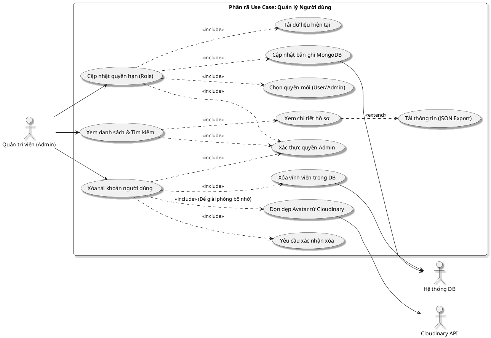

# Phân rã sơ đồ Use Case: Quản lý Người dùng (Admin)

Sơ đồ này mô tả chi tiết các quyền hạn của Quản trị viên trong việc giám sát và điều chỉnh tài khoản người dùng trên hệ thống.

## Hình 2.11: Sơ đồ Use Case Phân rã Quản lý Người dùng

### 1. Sơ đồ PlantUML

### 2. Mô tả các bước nghiệp vụ

| Hành động | Chi tiết xử lý |
| :--- | :--- |
| **Xem & Tìm kiếm** | Admin truy cập Dashbard -> Hệ thống gọi API liệt kê danh sách kèm bộ lọc theo tên/email. |
| **Xem chi tiết & Tải về** | Admin mở Modal chi tiết -> Hệ thống hiển thị Avatar (Cloudinary), Role, ID. Admin nhấn "Tải thông tin" -> Trình duyệt đóng gói JSON và cho phép tải xuống file. |
| **Cập nhật quyền (Role)** | Hệ thống **tải thông tin hiện tại** -> Admin chọn quyền mới -> Lưu vào MongoDB -> Hiệu lực ngay lập tức khi User load lại trang. |
| **Xóa tài khoản** | Admin xác nhận xóa -> Hệ thống thực hiện "Quy trình xóa sạch": Xóa bản ghi DB + **Gọi Cloudinary API xóa ảnh đại diện**. |

### 3. Các đặc điểm bảo mật
- **Admin không thể tự xóa chính mình**: Để tránh mất quyền quản trị cao nhất của hệ thống.
- **Xác thực JWT**: Mọi hành động Quản trị đều được kiểm tra Token và `role: "admin"` tại Middleware.
