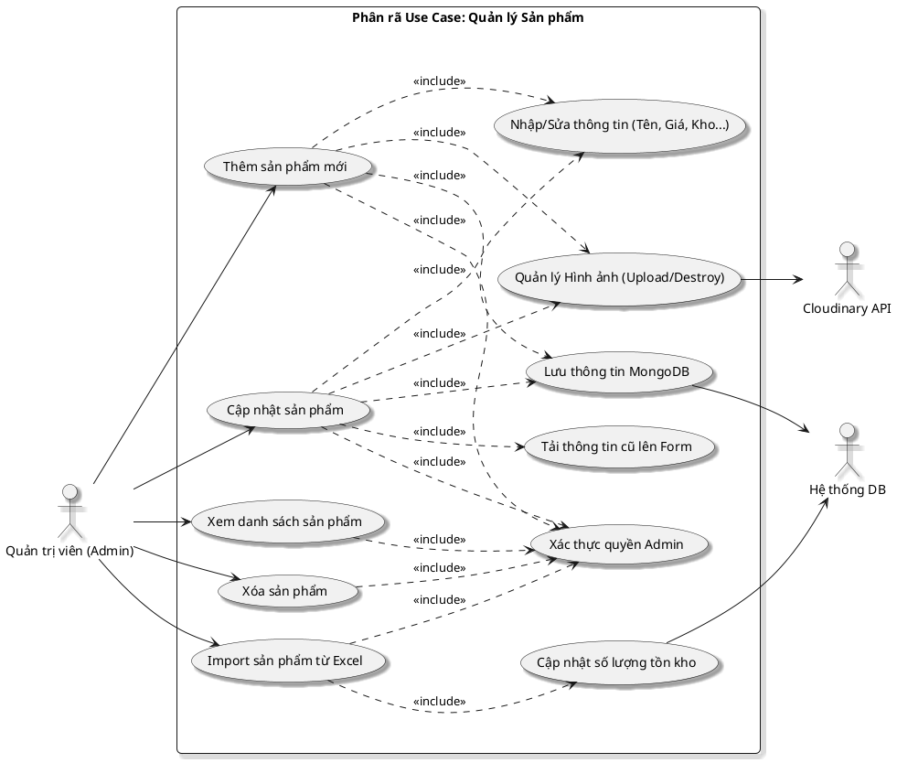

# Phân rã sơ đồ Use Case: Quản lý Sản phẩm (Admin)

Sơ đồ này mô tả các hoạt động của Quản trị viên trong việc vận hành kho hàng, từ thêm mới đến quản lý tệp tin đa phương tiện và dữ liệu Excel.

## Hình 2.9: Sơ đồ Use Case Phân rã Quản lý Sản phẩm

### 1. Sơ đồ PlantUML

### 2. Đặc tả các bước thực hiện

| Hành động | Chi tiết xử lý |
| :--- | :--- |
| **Thêm Sản phẩm** | Admin nhập thông tin -> Tải ảnh lên Cloudinary -> Lưu dữ liệu vào MongoDB. |
| **Cập nhật Sản phẩm** | Hệ thống **tải thông tin cũ** vào Form -> Admin chỉnh sửa các trường -> Hệ thống xử lý ảnh (giữ ảnh cũ, xóa ảnh cũ hoặc thêm ảnh mới) -> Lưu thay đổi vào MongoDB. |
| **Xóa Sản phẩm** | Xóa bản ghi trong MongoDB -> Hệ thống tự động dọn dẹp toàn bộ hình ảnh liên quan trên Cloudinary. |
| **Import Excel** | Hệ thống đọc tệp `.xlsx` -> Kiểm tra định dạng -> Map dữ liệu và **Cập nhật số lượng tồn kho** hàng loạt. |

### 3. Quy trình xử lý lỗi
- **Sai định dạng Excel**: Hệ thống báo lỗi "Header không hợp lệ" hoặc "Dữ liệu dòng X bị thiếu".
- **Lỗi Cloudinary**: Nếu upload ảnh lỗi, hệ thống sẽ rollback và báo lỗi cho Admin.
